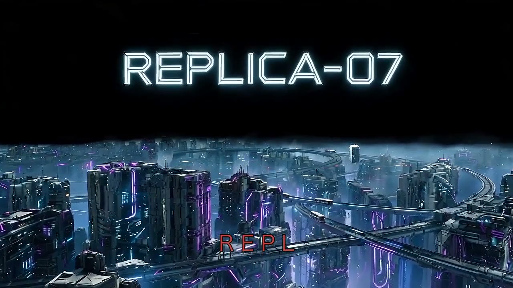
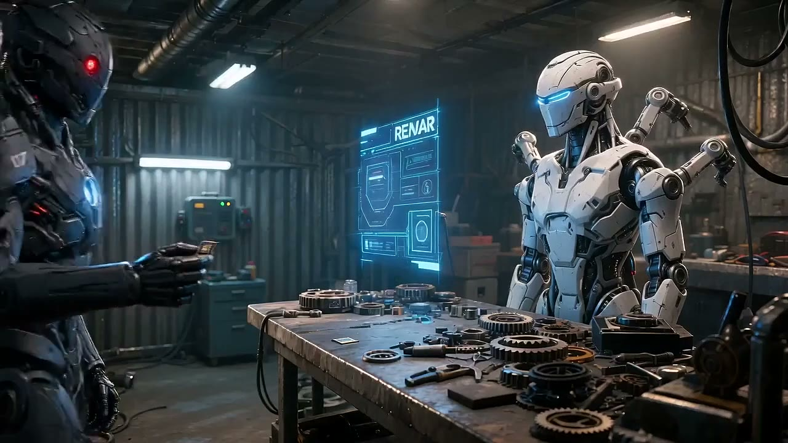
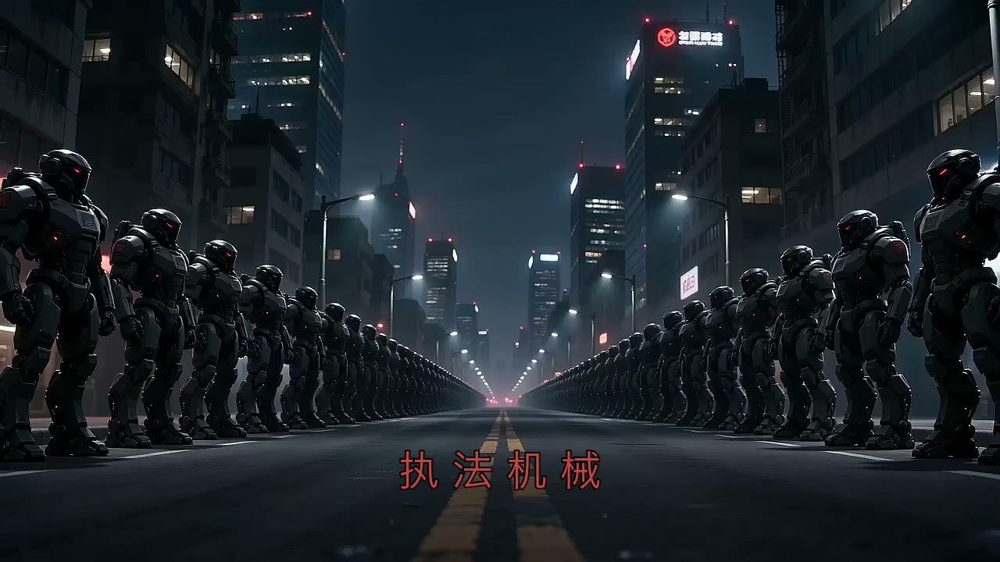
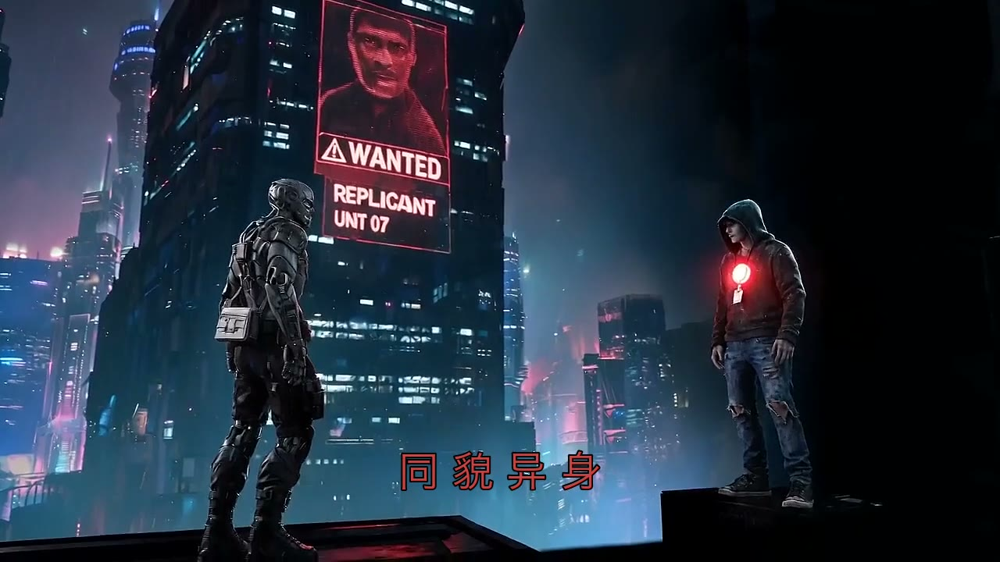
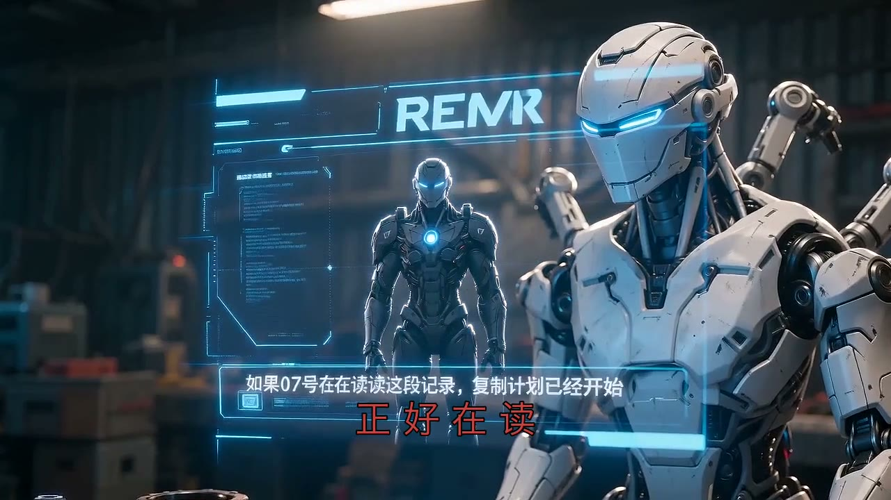
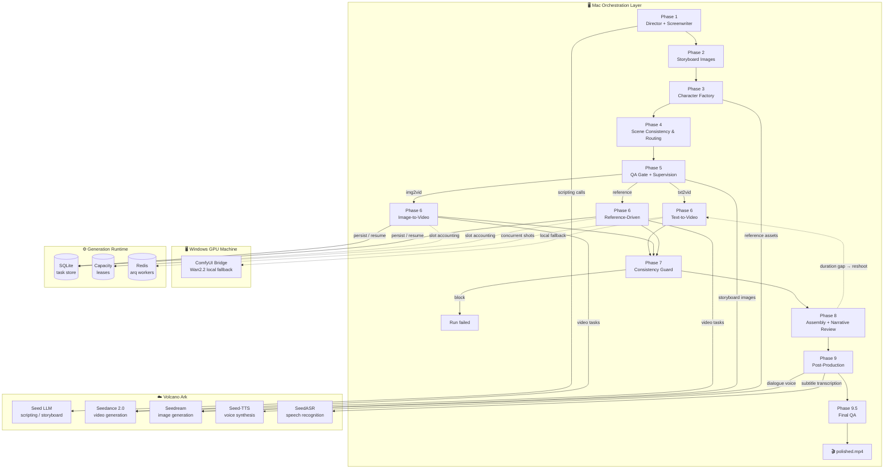

# HonCut — AI Video Generation Pipeline

HonCut is an end-to-end AI video generation pipeline that transforms arbitrary text input into a polished short film. It combines LLM-driven storytelling, character asset generation, multi-model video synthesis, narrative verification, and ASR-based post-production into a single reproducible pipeline.

## Demo — "REPLICA-07"

A 44-second cyberpunk short film generated fully automatically from a text script: 2189, the mechanical metropolis "New Port City", a synthetic mercenary, a chip handoff in the black-market repair station, and the beginning of the replica conspiracy.

**Full video:** download `REPLICA-07_polished.mp4` (44s, 1280×720, real ASR subtitles) from the [latest release](https://github.com/KuMaMon2019s/HonCutBag/releases/latest).

| Shot | Frame | Description |
|------|-------|-------------|
| S01 |  | REPLICA-07 enters New Port City through the rain |
| S02 |  | Chip handoff at the black-market repair station *(real ASR subtitle)* |
| S03 |  | Enforcement machines lock down the city |
| S04 |  | Same face, different body — the high-rise confrontation |



## Architecture

The normative post-refactor architecture, ownership rules, recovery precedence,
and repair checklist live in [docs/HONCUT_ARCHITECTURE.md](docs/HONCUT_ARCHITECTURE.md).
Historical roadmap and redesign documents are non-normative.

HonCut runs on a split-role deployment: a Mac orchestration layer drives a nine-phase pipeline, a Windows GPU machine hosts the ComfyUI Bridge for local synthesis fallback, and Volcano Ark provides online LLM scripting, Seedance video, Seedream image, Seed-TTS, and SeedASR services. All LLM scripting calls flow through a unified streaming client (`ark_llm`) with hard wall-clock timeouts, per-phase heartbeats, and sub-phase checkpoints so no phase can hang silently.

The production pipeline is a **LangGraph state graph** defined in `graph/workflow.py`, composed with concrete Phase owners by `graph/composition.py`, and executed by `runtime/pipeline_execution.py`. The QA gate selects one of three video-generation strategies (text-to-video / image-to-video / reference-driven), Phase 7 either hands validated evidence to Phase 8 or blocks, and the assembly engine owns the bounded reshoot cycle. Versioned Graph state persists through a SQLite checkpointer, so a run can be interrupted and resumed mid-pipeline.

Video generation runs behind a dedicated **runtime layer** (`runtime/`). A versioned SQLite task ledger persists Provider job IDs before polling and refuses blind resubmission when submission status is uncertain. One Runtime policy owns request deadlines, retry/backoff, cooldown, and capacity. Every paid request receives a secret-free semantic fingerprint; project/run/input lineage namespaces its cache identity; successful files are registered as strict `ArtifactRef` records in an atomically written per-run manifest. Known old State, task-ledger, and Artifact schemas migrate through explicit registries, while unknown future versions fail closed.



### Pipeline Phases

Phases use contiguous integer IDs (`phase1`–`phase9`); every phase writes a checkpoint and can be resumed with `--resume-from`.

| Phase | Name | Description |
|-------|------|-------------|
| Phase 1 | Screenwriter Engine | Text parsing → event extraction → sequence-aware Director intent (`scene_goal`, `emotion_arc`, `visual_focus`, `spatial_intent`, `transition_intent`) → character discovery → duration-scaled production action ledger → policy-driven primary-shot layout → layered cinematic adaptation → continuity-boundary classification → per-shot storyboard JSON with eight-layer prompts. Source wording and dialogue remain verbatim, while identity joins use language-neutral character/ref IDs and English controlled enums in the strict semantic ledger. Code owns action capacity; a strict Director-aligned selector may only choose source action indexes and records narrative purpose/emotional beat. Adaptation remains the sole owner of shot count, Sxx/Pxx layout, framing, controlled camera angle, movement, lighting, and duration. Sub-phase checkpoints and a 15s heartbeat keep it observable |
| Phase 2 | Storyboard Images | Per-shot storyboard images (Seedream) as visual reference for video generation |
| Phase 3 | Character Factory | Four canonical views, deterministic 2×2 reference board, QA receipts, character cards, and optional project-scoped reuse of exact approved packs |
| Phase 4 | Scene Consistency | Shot directory layout, timeline planning, scene consistency contracts, and continuity groups: a group starts from image references and later shots depend on the preceding video |
| Phase 5 | QA Gate + Supervision | L1/L2/L3 structural quality gate plus an LLM supervision agent (continuity / character / style / pacing / dialogue). Blocking visual failures trigger a bounded failed-shot redraw and full recheck (default 2 rounds, max 3); unresolved C/D grades still block video generation. On pass, a graph router picks the Phase 6 strategy (txt2vid / img2vid / reference) |
| Phase 6 | Video Generation | Continuity groups execute serially through Seedance while independent groups remain concurrent: group heads use multi-image generation and later shots use predecessor-video extension on the crash-safe runtime |
| Phase 7 | Consistency Handoff | Cross-shot consistency checks, scene-change detection, and slideshow-risk scoring; passing evidence moves to Phase 8 while blocking evidence ends the Graph before more paid work |
| Phase 8 | Assembly Engine | Temporal/SAM3 seam adjudication removes extension replay prefixes without interpolation; continuous boundaries use hard cuts while scene boundaries retain smart transitions, followed by narrative review and duration closure |
| Phase 9 | Post-Production | Real SeedASR transcription → subtitle burn-in, three-track audio mixing (original bed + TTS dialogue + ducking), color grading, rhythm editing, final encode |
| Phase 9.5 | Final QA | Delivery gate that validates the finished film before hand-off |

## Key Capabilities

- **Eight-layer prompt framework** — every shot prompt is assembled from eight structured layers (element reference, shot summary, audio, style anchor, quality suffix, negative guardrails), balancing concise shot descriptions with full constraint coverage.
- **Seedance-first with graceful fallback** — shots are generated via Seedance online API by default; on timeout or stall the pipeline falls back to local Wan2.2 generation through the Windows Bridge with explicit duration-loss logging.
- **Continuity-group generation** — the screenwriter labels real action continuations; each group begins from canonical multi-image references and subsequent shots extend the preceding video. Scene changes start fresh and remain eligible for editorial transitions.
- **Prose-action screenplay understanding** — Phase 1 recognizes scene-state prose, character damage/wardrobe state, unlabelled quoted dialogue, causal attack/counter chains, physical consequences, and relationship reversals. Neighboring text is supplied as read-only context, exact dialogue is confidence-attributed, and deterministic `sequence_id` / `action_unit_id` metadata survives into storyboard generation.
- **Continuity-first primary-shot layout** — the default `continuity` policy maximizes story-clock action capacity inside model and 25% Provider-padding limits, then minimizes Sxx count and boundaries. A long Sxx carries one continuous causal segment through one to three scoped Pxx requests; `balanced` follows the requested average more closely, while `cut-driven` preserves the historical short-shot algorithm.
- **Narrative-order verification (Phase 8)** — before assembly, storyboard images are reviewed against the full script with a multimodal LLM; extracted frames are scanned for black/still frames; a duration gate compares actual vs. target runtime and can trigger a bounded reshoot loop.
- **Real ASR subtitles (Phase 9)** — the final audio track is transcribed via SeedASR WebSocket (`volc.seedasr.sauc.duration`), merged across shots with cumulative time offsets, and burned into the film. Shots without speech fall back to script captions, explicitly marked `script_fallback` — no fabricated timelines.
- **Unified streaming LLM client** — every Phase 1 scripting call flows through a single streaming client with hard wall-clock timeouts (forced stream termination, not just a pre-request budget check), a 15-second heartbeat, and sub-phase checkpoints, so a hung LLM call can never block the pipeline silently for hours.
- **Concurrent shot queue** — storyboard and shot generation can run through an optional arq/Redis queue with multiple workers, per-shot wall-clock deadlines, exponential backoff, and crash recovery that resumes from the last persisted shot instead of restarting.
- **Three-tier run memory** — a per-run SQLite memory (short-term events, rolling summaries, semantic retrieval) lets later phases and re-runs recall what happened earlier without re-deriving it.
- **LLM supervision agent** — a streaming LLM reviewer (continuity / character / style / pacing / dialogue) grades the storyboard before video generation; advisory by default, optionally blocking.
- **Fictional-character declaration** — reference-image and video prompts declare AI-generated fictional characters to reduce real-person content moderation friction.
- **Checkpoint & resume** — per-phase checkpoint files with `--resume-from` recovery restart from any phase without re-running completed work; the LangGraph state persists through a SQLite checkpointer so an interrupted run resumes mid-pipeline.
- **Crash-safe generation runtime** — video tasks persist their provider job IDs in a SQLite task store; cross-process capacity leases limit concurrent provider calls, and after a crash the pipeline resumes polling in-flight jobs instead of resubmitting and double-paying.
- **Typed artifact and cache lineage** — local artifacts carry project/run identity, content hashes, producer task IDs, parent assets, and semantic fingerprints. Cache reuse requires an exact project + run + input-lineage + generation-fingerprint match.
- **Fail-closed operational boundaries** — workspace paths are symlink-safe, Provider responses are schema-validated, subprocesses use argument arrays, and correlated Runtime logs redact credentials and full Prompts.
- **Quality supervision** — four red-line checks (asset validity, script fidelity, concreteness, parent-child assets) with A/B/C/D grading gate before assembly.

## Project Structure

```
honcut/
├── pipeline/           # Python video pipeline
│   ├── src/
│   │   ├── graph/      # LangGraph workflow (state, nodes, routing)
│   │   ├── runtime/    # Lifecycle, task ledger, policy, lineage, artifacts, security
│   │   ├── phases/     # Business owners (phase1/ … phase9/); test-only core facade
│   │   ├── prompt/     # Prompt engineering modules
│   │   ├── schemas/    # Typed schemas (story, quality, workflow, …)
│   │   ├── clients/    # Provider clients (Seedance, Seedream, ASR, InvokeAI, TOS, …)
│   │   ├── tools/      # Media tools (audio, character, enhancement, …)
│   │   ├── quality/    # QA gates, supervision agent, consistency guard
│   │   └── utils/      # ark_llm streaming client, run memory, config
│   ├── scripts/        # Orchestrator + shot queue worker entry points
│   ├── prompts/        # Prompt templates
│   └── requirements.txt
├── assets/demo/        # Demo frames (see Releases for full videos)
├── docker/             # Docker Compose (Qdrant, MinIO, n8n)
├── data/               # Input/output data
├── scripts/            # Utility scripts
├── Makefile            # Common commands
├── pyproject.toml      # Python project config
├── uv.lock             # Locked Python dependency graph
├── .python-version     # Project interpreter pin
└── environment.yml     # Legacy Conda runtime compatibility
```

## Quick Start

```bash
# Install uv and FFmpeg once (macOS example)
brew install uv ffmpeg

# Create .venv with the pinned interpreter and locked dependencies
make install
# Install the pinned local CLIP model used for fixed-enum style ranking
make install-style-model
make doctor

# Run the full pipeline from a script
uv run --locked --managed-python python pipeline/scripts/phase_orchestrator.py \
  --config config.json --auto-approve

# Or invoke the stable CLI directly with an explicit cache/project namespace
uv run --locked --managed-python python pipeline/src/pipeline_runner.py \
  --input story.txt --output-dir workspaces/example/output --project-id studio-a \
  --character-library-dir /absolute/path/to/studio-character-library \
  --shot-policy continuity

# Resume from a checkpoint (e.g. after a single shot failure)
uv run --locked --managed-python python pipeline/scripts/phase_orchestrator.py \
  --config config.json --resume-from phase5
```

`uv.lock` and `.python-version` are authoritative. Project commands must use
`make` or `uv run --locked ...`; bare `python`, `pip`, and `pytest` may resolve
to an unrelated Conda or system interpreter.

`--character-library-dir` is optional and disabled by default. When enabled,
Phase 3 only reuses an immutable `canonical_approved` pack from the same
`project-id` with an exact versioned character-spec match and valid QA,
approval, and file hashes. Similarity search does not authorize automatic
reuse, and state variants are not promoted by the v1 registry.

`--shot-policy` accepts `continuity`, `balanced`, or `cut-driven`. Fresh runs
default to `continuity`; `--shot-duration` is a soft preference for
`continuity` and `balanced`, but remains a hard editorial target for
`cut-driven`. Historical manifests and checkpoints without `shot_policy`
resume deterministically as `cut-driven`.

Online visual generation uses the Volcano Ark Agent Plan only. Configure
`ARK_AGENT_API_KEY`; HonCut does not read `ARK_API_KEY`, which remains reserved
for the Honcho Coding Plan memory integration. Seedream image generation uses
the Agent Plan model `doubao-seedream-5.0-lite` with a default `2K` PNG output.
Linked Git worktrees automatically reuse the main HonCut checkout's `.env`, so
clean worktree runs do not inherit a stale launcher key or require secret copies.
Seedance image/video inputs are always uploaded to TOS before submission, so
online video generation also requires `TOS_ACCESS_KEY`, `TOS_SECRET_KEY`, and
`TOS_BUCKET`; upload failure stops before the Provider call rather than
silently degrading to text-only generation. Generated videos are downloaded
directly from the Provider; they are uploaded to TOS only when reused as input
material for extension, editing, or reference generation.

## Development

### Code Quality

The project uses **Black** for formatting and **Ruff** for linting:

```bash
make lint
uv run --locked --managed-python python -m black --check pipeline/src/ pipeline/tests/
```

### Testing

```bash
make test
```

## Dependencies

- Python 3.12.13 (pinned by `.python-version`)
- LangGraph + langgraph-checkpoint-sqlite (workflow graph & state checkpointing)
- Docker & Docker Compose
- FFmpeg
- Volcano Ark API (Seedance, Seedream, SeedASR, Seed-TTS)
- Optional Redis (arq shot queue)
- Windows Bridge (ComfyUI + Wan2.2) for local video fallback

## License

MIT
