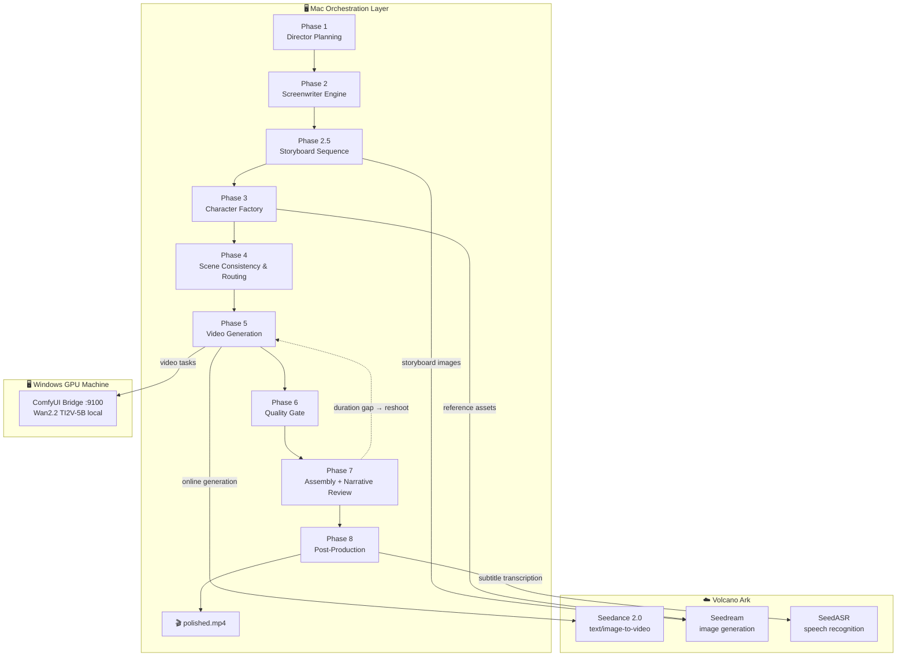

# HonCut — AI Video Generation Pipeline

HonCut is an end-to-end AI video generation pipeline that transforms arbitrary text input into a polished short film. It combines LLM-driven storytelling, character asset generation, multi-model video synthesis, narrative verification, and ASR-based post-production into a single reproducible pipeline.

## Demo — "REPLICA-07"

A 44-second cyberpunk short film generated fully automatically from a text script: 2189, the mechanical metropolis "New Port City", a synthetic mercenary, a chip handoff in the black-market repair station, and the beginning of the replica conspiracy.

**Full video:** download `REPLICA-07_polished.mp4` (44s, 1280×720, real ASR subtitles) from the [latest release](https://github.com/KuMaMon2019s/HonCutBag/releases/latest).

| Shot | Frame | Description |
|------|-------|-------------|
| S01 |  | REPLICA-07 enters New Port City through the rain |
| S02 |  | Chip handoff at the black-market repair station *(real ASR subtitle)* |
| S03 |  | Enforcement machines lock down the city |
| S04 |  | Same face, different body — the high-rise confrontation |


## Architecture

HonCut runs on a split-role deployment: a Mac orchestration layer drives the pipeline, a Windows GPU machine hosts the ComfyUI Bridge for local synthesis, and Volcano Ark provides online Seedance video + Seedream image + SeedASR/Seed-TTS services.



### Pipeline Phases

| Phase | Name | Description |
|-------|------|-------------|
| Phase 1 | Director Planning | Scene breakdown, emotion analysis, and transition design before storyboarding |
| Phase 2 | Screenwriter Engine | Text parsing → event extraction → character discovery → adaptation → storyboard generation with eight-layer prompt framework |
| Phase 2.5 | Storyboard Sequence | Per-shot storyboard images for visual reference |
| Phase 3 | Character Factory | Character reference assets (face close-up + full-body + variants) + character cards |
| Phase 4 | Scene Consistency | Shot scheduling, timeline planning, scene consistency contracts, and model routing |
| Phase 5 | Video Generation | Video clip generation via Seedance online API with Wan2.2 local fallback through the Windows Bridge |
| Phase 6 | Quality Gate | Consistency checks, red-line supervision, and A/B/C/D grading |
| Phase 7 | Assembly Engine | Clip stitching with smart transitions, multimodal narrative-order review, frame analysis (black/still frame detection), and duration gate with optional reshoot loop |
| Phase 8 | Post-Production | Real SeedASR transcription → subtitle burn-in, ambient audio, color grading, rhythm editing, final encode |

## Key Capabilities

- **Eight-layer prompt framework** — every shot prompt is assembled from eight structured layers (element reference, shot summary, audio, style anchor, quality suffix, negative guardrails), balancing concise shot descriptions with full constraint coverage.
- **Seedance-first with graceful fallback** — shots are generated via Seedance online API by default; on timeout or stall the pipeline falls back to local Wan2.2 generation through the Windows Bridge with explicit duration-loss logging.
- **Chain mode (last-frame relay)** — optional serial generation where each shot's last frame becomes the next shot's first frame, physically inheriting character appearance, lighting, and scene continuity across shots.
- **Segmentation-aware shot duration** — shot length follows video-model segmentation best practice (medium-form video: fewer, longer shots, one clear plot beat per shot) instead of many short fragments. Duration is computed as `max(4, min(15, num_frames // fps))` and passed through to Seedance.
- **Narrative-order verification (Phase 7)** — before assembly, storyboard images are reviewed against the full script with a multimodal LLM; extracted frames are scanned for black/still frames; a duration gate compares actual vs. target runtime and can trigger a bounded reshoot loop.
- **Real ASR subtitles (Phase 8)** — the final audio track is transcribed via SeedASR WebSocket (`volc.seedasr.sauc.duration`), merged across shots with cumulative time offsets, and burned into the film. Shots without speech fall back to script captions, explicitly marked `script_fallback` — no fabricated timelines.
- **Fictional-character declaration** — reference-image and video prompts declare AI-generated fictional characters to reduce real-person content moderation friction.
- **Checkpoint & resume** — per-phase checkpoint files with `--resume-from` recovery restart from any phase without re-running completed work.
- **Quality supervision** — four red-line checks (asset validity, script fidelity, concreteness, parent-child assets) with A/B/C/D grading gate before assembly.

## Project Structure

```
honcut/
├── pipeline/           # Python video pipeline
│   ├── src/            # Source modules (phases, clients, tools, quality)
│   ├── scripts/        # Orchestrator entry points
│   ├── prompts/        # Prompt templates
│   └── requirements.txt
├── assets/demo/        # Demo frames (see Releases for full videos)
├── docker/             # Docker Compose (Qdrant, MinIO, n8n)
├── data/               # Input/output data
├── scripts/            # Utility scripts
├── Makefile            # Common commands
├── pyproject.toml      # Python project config
└── environment.yml     # Conda environment
```

## Quick Start

```bash
# Create conda environment
conda env create -f environment.yml
conda activate honcut

# Run the full pipeline from a script
python pipeline/scripts/phase_orchestrator.py \
  --config config.json --auto-approve

# Resume from a checkpoint (e.g. after a single shot failure)
python pipeline/scripts/phase_orchestrator.py \
  --config config.json --resume-from phase5
```

## Development

### Code Quality

The project uses **Black** for formatting and **Ruff** for linting:

```bash
pip install -e ".[dev]"
black pipeline/src/ pipeline/tests/
ruff check pipeline/src/ pipeline/tests/
```

### Testing

```bash
make test
# or
pytest pipeline/tests/ -v --cov=pipeline/src
```

## Dependencies

- Python 3.11+
- Docker & Docker Compose
- FFmpeg
- Volcano Ark API (Seedance, Seedream, SeedASR, Seed-TTS)
- Windows Bridge (ComfyUI + Wan2.2) for local video fallback

## License

MIT
