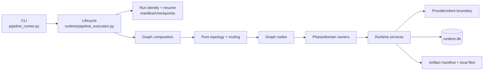
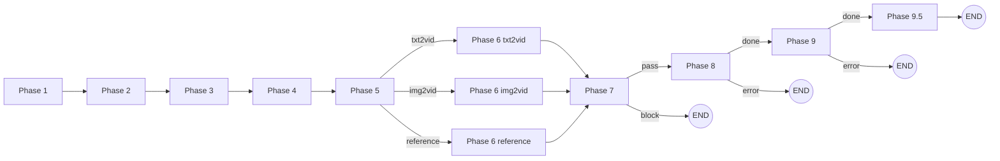

# HonCut 改造后架构规范

> 状态：Normative（后续开发与修复的架构事实源）
>
> 适用基线：`main`，重构验收提交 `1b01741` 及之后版本
>
> 更新日期：2026-08-23

本文定义 HonCut 当前生产架构、持久化与恢复契约，以及后续迭代修复必须遵守的边界。实现与本文冲突时，先确认生产执行路径；若实现是有意变更，必须在同一提交中更新本文和相应特征测试。

`docs/PIPELINE.md`、历史 redesign/roadmap/audit 文档只保留设计背景，不再作为模块所有权或 Phase 编号的依据。

## 1. 架构目标与不变量

HonCut 的核心目标不是“完成一次生成”，而是在长耗时、可能付费、可能崩溃的媒体任务中，保持可恢复、可审计、可去重和可验证。

以下规则不可通过降级路径绕过：

1. Graph State 只保存 JSON-safe 的标识、路径、状态和必要元数据；图片、视频、base64、日志正文、客户端与打开的句柄只存在于文件系统或 Runtime。
2. `RUN_MANIFEST.json` 绑定输入、配置、Provider、模型、代码版本和 `project_id`。身份不一致时禁止恢复；代码变化只能通过显式 `--accept-code-change` 和明确恢复边界接纳。
3. 已知旧版本必须确定性迁移；未知未来 State、checkpoint、task DB 或 Artifact schema 必须 fail closed。
4. 任何可能付费的视频提交都必须先进入 `GenerationTaskStore`，提交后立即持久化 Provider job ID；`submission_uncertain` 禁止盲目重提。
5. QA、重试、补拍与连续性回流都有有限次数和终止状态。缺失、损坏或不可验证的证据不能被解释为成功。
6. Artifact、checkpoint、cache 和任务复用不得跨越 `project_id`、run identity 或输入血缘。
7. 日志与 fingerprint 不得包含密钥、授权头或完整私有 Prompt；子进程参数必须使用数组，工作区路径必须阻止绝对路径越界、`..` 越界和符号链接逃逸。
8. CLI 参数、Phase 状态、主要输出路径、receipt 和 `pipeline_report.json` 保持兼容；破坏性修改必须提供版本化迁移与兼容测试。

## 2. 逻辑分层与依赖方向



规范依赖方向为：

```text
CLI → Lifecycle → Graph composition → Graph node → Phase/domain
    → Runtime policy/executor → Provider/client and Artifact storage
```

Schema、State 和纯工具是共享契约，但不得反向触发上层工作。低层模块不得导入高层模块来决定全局执行顺序。

| 关注点 | 唯一生产 owner | 约束 |
|---|---|---|
| CLI 参数与退出码 | `pipeline/src/pipeline_runner.py` | 只解析、规范化和分发，不实现 Phase 业务 |
| 运行生命周期与模式选择 | `pipeline/src/runtime/pipeline_execution.py` | 创建 run identity、选择 Graph/顺序路径、写总报告 |
| 唯一生产拓扑 | `pipeline/src/graph/workflow.py` | 只定义节点和边，不导入 Provider 或 Phase 实现 |
| 依赖装配 | `pipeline/src/graph/composition.py` | 把窄 Phase callable 注入节点，不创建第二套拓扑 |
| State 与迁移 | `graph/state.py`、`graph/migrations.py` | 生产写 canonical 字段；旧别名只在迁移适配器读取 |
| Phase 业务 | `pipeline/src/phases/phaseN/` | 文件、模型、媒体和领域规则归对应 Phase owner |
| 超时、重试、冷却与容量 | `pipeline/src/runtime/provider_policy.py` | Provider、Graph 和 Phase 不得叠加重试 |
| 长任务账本 | `pipeline/src/runtime/generation_tasks.py` | SQLite 幂等迁移、提交去重、恢复与终态证据 |
| Artifact 血缘 | `schemas/artifact.py`、`runtime/artifact_manifest.py` | 严格 schema、内容哈希、父资产与原子 manifest |
| Provider 传输 | `runtime/video_provider.py` 与现有 clients/adapters | submit/status/cancel、能力和错误分类；不决定全局策略 |

`pipeline/src/phases/pipeline_core.py` 是 386 行的测试兼容门面，生产代码对它没有引用。禁止在其中增加新业务、恢复、Provider 或拓扑逻辑；新测试应优先向真实 owner 注入依赖，逐步消除门面。

## 3. 生产执行模型

### 3.1 入口与两种受支持路径

`pipeline_runner.py` 将稳定 CLI 参数传给 `runtime.pipeline_execution.run_pipeline()`。Lifecycle 在访问 checkpoint 前完成输入读取、配置解析和 run manifest 校验。

- 完整运行、无 `skip_phase`、新运行或可信 Graph 恢复：使用 LangGraph。
- `--phase`、`--start-phase`、`--end-phase`、`--skip-phase`，以及来自非 Graph checkpoint 的兼容恢复：使用顺序执行器。
- Graph 初始化或执行失败时直接返回 failed，不允许静默切换到顺序执行器重复副作用。
- 两条路径调用相同的 Phase owner、质量门、checkpoint 和报告契约；修复公共行为时必须同时验证两条路径。
- 人工故事板 review 已永久禁用；`auto_approve` 只是 checkpoint/CLI 兼容字段，两种取值都不能创建 Graph interrupt。

### 3.2 Canonical Graph



Phase 5 的路由优先级固定为：任一 shot 的 `ref_type=reference` → reference；否则存在 storyboard image → img2vid；否则 txt2vid。Phase 7 的 Graph 路由只做 pass/block，像素级修复和付费补拍由 Phase 8 的有限闭环拥有。

Graph node 必须只完成三件事：读取 State、调用一个窄 owner、返回 State patch。节点不得直接读写媒体、运行 subprocess、调用网络/模型或实现重试。

### 3.3 Phase 所有权

| Phase | 业务 owner 与输出责任 | 主要失败边界 |
|---|---|---|
| 1 | 导演规划、文本解析、事件/角色发现、分层剧本与 canonical `STORYBOARD.json` / `CHARACTERS.json` | 输入/LLM/结构无效即停止；子阶段 checkpoint 可复用 |
| 2 | 分镜与 Pxx 图像资产、构图和端帧契约 | 生产图片或其验证证据缺失时 fail closed |
| 3 | 角色卡、四视图、变体和身份锁定 | 生产模式要求真实四视图 QA；dry-run 只写明确的 dry-run receipt |
| 4 | 原生 shot 目录与 `SHOT_META.json`、场景一致性、continuity plan、cinematic first-frame | canonical storyboard 不得为元数据物化而原地改写；Phase 4 不运行视频生成子进程 |
| 5 | storyboard QA、生成容量、variation/slideshow、监督与进入视频生成前的硬门 | C/D 或 blocking supervision 阻止 Phase 6；dry-run 不做像素/模型监督 |
| 6 | 视频生成与 continuity chunk 执行 | 所有长请求经过 Runtime task ledger；相同输入恢复不得重复提交 |
| 7 | 生产一致性检查与 Phase 8 质量所有权交接 | 结构/一致性阻断后结束，不在 Graph 内直接重提视频 |
| 8 | inventory、顺序复核、连续性裁决、逐镜像素 QA、有限补拍、转场、受审剪辑和时长闸门 | 补拍最多两轮；连续边界使用硬切；无法安全应用 trim/QA 时禁止 raw concat 降级 |
| 9 | ASR、音频/TTS/ducking、字幕、视觉后期、节奏编辑和最终编码 | 最终时长/编码失败即停止；可选 QA 必须在 receipt 中明确标记 |
| 9.5 | 成片交付 QA | 不通过则顶层 run failed，不交付伪成功 |

Phase 1 的时长合同采用双账本：一级 `Sxx` 与其二级 `Pxx` 共用同一个故事时钟，二者不得相加，且新规划的故事时钟不得超过交付时长；跨一级镜头的 bridge 是独立 Provider 生成开销，只加入生成账本。`honcut.material-budget.v2` 必须同时记录故事时钟、Pxx 分区校验、bridge 实际/规划时长区间、总生成时长及其实际/区间比率。历史 `1.3` 只可作为成本参考值，不是容量硬上限；Phase 8 的安全变速区间是独立编辑合同，不得从生成开销比率反推。

当完整事件账本超过交付故事时钟的可执行容量时，Phase 1 只能通过 `dropped_source_events` 显式记录被删减的非关键事件；这些事件不得进入 `source_events`、Pxx、Prompt 或媒体生成。`scene_setup`、`turning_point`、`dramatic_turn` 与 `consequence` 必须保留。Phase 5 必须 fail closed 校验故事时钟上限、Sxx/Pxx 等时、bridge 区间/把手以及持久化 material ledger；未知或旧 material-budget schema 不得解释为成功。

Canonical 事件账本要求 `dramatic_turn=true` 当且仅当 `event_role=turning_point`。事件提取模型返回冲突组合时，Event Extractor 必须携带具体 schema 错误进行一次有界纠错；仍不一致则 fail closed，禁止把普通动作链提升为必保转折或静默丢失真实转折。改变该规范化规则必须升级事件缓存 schema。

全局角色一致性、摄影、风格和负面约束属于项目级 Prompt/视觉风格合同，不占故事时钟，也不得被解释为 `scene_setup`、`character_state` 或 `transition`。Event Extractor 必须在进入 adaptation 前确定性排除只含此类指令且没有剧情动作/台词的记录；改变这项分类规则必须升级事件缓存 schema，防止复用旧的时间线事件。

Phase 1 的骨架账本按 screenplay `sequence_id` 预先分配连续且互不合并的 beat 槽位。包含必保事件的 sequence 必须获得足以承载必保动作单元的槽位；只含可删事件的 sequence 不得无条件强占故事时钟，可在容量不足时整体进入 `dropped_source_events` 并绑定到相邻已规划槽位留审计证据。模型返回跨 sequence、遗漏必保事件或超过故事时钟动作容量时，Phase owner 必须按固定槽位确定性重建 `source_events` / `dropped_source_events`：必保事件不得删除，删减只能显式进入 dropped 账本，重建后仍不满足容量则 fail closed。

Phase 1 的 adaptation 对任意事件数量都固定执行分层骨架与分批镜头展开；生产路径不存在按事件数回退为单次 Prompt 的分支，也不得通过环境变量重新启用旧单次调用路径。分层 checkpoint 是唯一可恢复的 adaptation 中间状态。

Phase 间调用原则上通过 Graph/Lifecycle。唯一允许的业务闭环是已建模且有限的修复路径，例如 Phase 8 调用注入的 Phase 6 生成 callable；该依赖必须可测试注入，并在所有递归轮次中保持一致。

新运行的 canonical 媒体默认值是 `media_profile=480p`。Graph 与顺序执行器必须把该字段显式传给共同的 Phase 6 owner；Phase 6 再把它解析成 Agent Plan 顶层 `resolution`，同时写入 generation fingerprint 与 `GenerationTaskStore` payload。当前 Agent Plan 默认视频模型名固定为精确字符串 `doubao-seedance-2.0-fast`，不得使用按量 API 的日期版本 ID 或错误的全连字符拼写；模型或分辨率变化必须形成不同任务身份，Fast/Mini 请求超出 480p/720p 时在提交前 fail closed。

## 4. State、身份与恢复

### 4.1 Canonical State

新运行必须先构建严格的 `GraphRunConfig`，再由 `initial_state_from_config()` 生成 `HonCutState`。当前 State schema version 为 1。

Canonical 字段包括：

- 身份与配置：`state_schema_version`、`run_id`、`run_fingerprint`、`project_id`、输入、时长、媒体配置和恢复参数。
- 领域元数据：storyboard、characters、shot IDs，以及 QA/一致性摘要。
- Artifact 路径：`assembled_video`、`final_video`；不包含媒体内容。
- 编排元数据：`phase_results`、`completed_phases`、`current_phase`、`status`、结构化 `errors` 与有限尝试计数。

`text/duration/shot_duration/transition_duration/shots/videos/quality_report/error` 是只读旧别名。生产 composition 会在 checkpoint 前移除这些字段；新代码不得继续写它们。

### 4.2 Run identity

`RUN_MANIFEST.json` 是恢复身份的前置条件，绑定：

- 输入文本 SHA-256；
- 规范化后的配置与 `project_id`；
- Provider、模型和项目视频规格；
- Git commit 与源码内容形成的 code version；
- 由上述语义生成的稳定 `run_fingerprint`。

新运行不得复用包含另一 run 产物的输出目录。恢复时，输入/配置/项目身份变化一律拒绝；显式接受代码变化只改变被批准的代码历史，不改变原始 run fingerprint。

### 4.3 恢复证据优先级

恢复按以下顺序决策：

1. 验证 `RUN_MANIFEST.json`、`run_fingerprint`、`project_id` 和代码变更历史。
2. 优先读取以 run fingerprint 为 thread ID 的 Graph SQLite state。
3. 兼容读取 `pipeline_run` thread 的 stage SQLite state。
4. 若无可信 SQLite state，读取版本化 `checkpoint.json`。
5. 对选中的 completed phases 应用 `checkpoint_phaseN.json` receipt；stale/failed receipt 会截断该 Phase 及下游完成状态。
6. Phase 6 恢复继续以 `runtime.db` 的 Provider job 状态和输出哈希为事实源，绝不因 Graph/JSON 缺口盲目重提。

`--resume-from phaseN` 必须先验证上游 Artifact，然后将目标 Phase 及全部下游 checkpoint/receipt 标 stale。SQLite checkpointer 初始化失败可以让新 Graph 以无 checkpoint 模式运行，但已存在且不可信的恢复证据不能被忽略。

## 5. Provider 与持久化任务

`VideoProvider` 的窄协议是 `submit`、`status`、可选 `cancel`、capabilities 和规范化错误。现有 Seedance/Bridge 客户端由 Runtime executor 适配；Phase 不得自行组合嵌套重试。

一条视频任务的生命周期为：

```text
immutable payload + fingerprint
  → enqueue/active dedupe
  → atomic claim
  → provider submit
  → persist provider_job_id + endpoint
  → poll/download/validate
  → register ArtifactRef
  → succeeded
```

任务规则：

- `runtime.db` 使用 WAL 和 `PRAGMA user_version`；当前 schema version 为 2，迁移只能增量且保留旧记录。
- active dedupe key 至少包含 run、task type、resource 和 Provider；已存在 active task 时 payload 必须字节语义一致。
- successful reuse 要求 Provider、payload、`input_fingerprint`、文件存在性、媒体有效性和已记录哈希全部匹配。
- claim 后未确认是否提交的进程中断进入 `submission_uncertain`；只能恢复轮询或由人工/确定性证据裁决，不能创建第二个付费请求。
- 已持久化 job ID 的任务只有在 Provider 明确报告 terminal failure 时才能标 failed。
- timeout、poll deadline、rate-limit retry、backoff、cooldown 和 capacity 只由 Runtime policy 拥有。未知、认证、moderation 和 submission-uncertain 错误不自动重试。
- Provider 响应先通过 Pydantic envelope 验证；错误信息只保留安全摘要，不落完整响应或密钥。

## 6. Artifact、Prompt 与 Cache 血缘

本地文件系统仍是媒体内容存储；`ARTIFACT_MANIFEST.json` 是每个 run 的严格元数据索引，不引入对象存储或外部数据库作为正确性前提。

`ArtifactRef` 至少记录 schema version、artifact/run/project ID、类型、内容 SHA-256、相对路径、生产节点/任务、父资产、可选语义 fingerprint 和创建时间。注册与读取规则如下：

- 路径必须位于 run 目录内并使用相对 POSIX 表示；
- parent ID 必须存在、唯一且不能自引用；
- manifest 身份必须与 `RUN_MANIFEST.json` 一致；
- 注册时校验实际内容哈希，读取 lineage-sensitive 产物时再次验证；
- manifest 通过同目录临时文件、`fsync` 和 `os.replace` 原子更新；
- 跨项目、缺失父资产、哈希不匹配、未知版本或 provenance 冲突全部 fail closed。

付费生成 fingerprint 固定包含 Prompt 模板 ID/版本、Prompt 内容哈希、Provider/模型 ID 与版本、语义参数和输入 Artifact 哈希，并递归排除 credential 字段。Cache key 固定包含：

```text
project_id + run_id + input lineage + semantic generation fingerprint
```

Seedance 2.0 最终提示词的生产 owner 是 Phase 6 `video_generator.build_video_prompt()`；带 `[honcut-video-generation-contract-v2]` 的完整合同必须由模型 router 原样透传，router 不得重排、摘要或追加重复元数据。组装顺序固定为：参考素材/精准主体 → 按事件顺序的动作细节 → 场景环境与光影 → 单一主运镜 → 视觉风格/画质 → 输出约束。重要主体和素材绑定必须前置；不得使用 `0–3 秒`一类精确子镜时码，不得用抽象情绪替代可见表情/呼吸/重心变化，不得在一个镜头同时指定多种主运镜。台词、音效和音乐分别使用 `{}`、`<>`、`（）` 标记；除非剧本显式要求可见文字，必须明确约束无字幕、无 Logo 与无水印。真实输出分辨率只由 `media_profile` 经 Runtime 映射为 Provider 参数，提示词只描述“高清细节”等视觉质量，不得用 `4K` 文案覆盖或暗示与请求参数不同的分辨率。

Seedance 在线请求中的所有图片和视频输入素材必须先上传 TOS，再以签名 HTTPS URL 写入 `content[].image_url.url` 或 `content[].video_url.url`；禁止内联 Base64/data URL、本地路径以及 TOS 失败后的纯文本降级。素材入口在读取完整文件和上传之前执行 Seedance 媒体规格预检：图片须满足官方格式、`[300, 6000]` 边长、`[0.4, 2.5]` 宽高比和小于 30 MB；视频须满足 MP4/MOV、H.264/H.265、`[24, 60]` FPS、`[2, 15]` 秒、官方像素面积范围和不超过 200 MB。图片压缩只在接近 30 MB Provider 上限时发生，先保留分辨率调整 JPEG 质量、最后才逐级缩放且不得低于 300 px；禁止沿用 300 KB 目标破坏角色、动作和纹理细节。Provider 边界必须再次验证 URL 的 scheme、配置 bucket/endpoint、TOS4 credential scope、签名字段和有效期，普通公网 HTTPS 或另一 bucket 的 URL 不能解释为已完成的 TOS 上传。

Provider 生成结果仍从返回 URL 直接下载并按 Artifact 合同落盘，不要求同步到 TOS；只有当该结果随后被用作延长、编辑或参考生成的输入素材时，才在下一次提交前上传 TOS。提示词中的“图片 N / 视频 N”按 `content[]` 中同类媒体的真实提交顺序编号；任一媒体上传缺失或失败时，必须在 Provider 提交和付费任务之前 fail closed，不能删除该媒体后重排编号继续提交。`role=first_frame/last_frame/reference_image/reference_video` 仍是媒体控制语义的事实源，编号只负责 Prompt 引用。

Seedream 图片请求的唯一传输 owner 是 `clients/seedream_client.py`，Phase 1–4 只拥有各自的导演板、Pxx、角色参考和 cinematic first-frame 语义。HonCut 的 Agent Plan 图片合同固定使用专属 `/api/plan/v3/images/generations`、`ARK_AGENT_API_KEY` 与精确模型名 `doubao-seedream-5.0-lite`；不得把按量模型 ID、按量 Base URL 或 `ARK_API_KEY` 混入请求。新图片默认使用 `2K` 档位，单图非流式输出固定为 PNG、无水印、`sequential_image_generation=disabled`、`optimize_prompt_options.mode=standard`。显式 WxH 仍可用，但必须在 Provider 调用前满足 5.0 lite 的总像素与宽高比范围；生成一张输出时最多接收 14 张参考图，使输入图与输出图总数不超过 15。

多参考图的职责绑定由共享模板 `honcut.seedream.reference-contract` v1 在 Phase 图片组装边界按真实输入顺序前置为 `Image 1`、`Image 2` 等；角色身份、上一故事格、导演单格和上一 cinematic 帧不得交换职责。Phase 收据必须记录模板 ID/版本、实际 Provider Prompt SHA-256、参考图顺序/角色和只含长度/哈希的 guidance 指标。官方 300 个中文字符/600 个英文单词是效果建议而非 API 硬限制；Transport 只能观测并报告超限，不得截断身份、动作、纠偏或连续性合同。Provider 的同步响应必须先通过严格 envelope 校验，24 小时 URL 产物须立即下载、验证为可解码图片并原子落盘；损坏、空数组、同时缺失/同时出现 URL 与 Base64 均 fail closed。

多模态理解的唯一传输 owner 是 `clients/ark_multimodal_client.py`。它固定通过标准方舟 `https://ark.cn-beijing.volces.com/api/v3/responses` 使用 Responses content schema：图片、视频、PDF、音频分别写为 `input_image.image_url`、`input_video.video_url`、`input_file.file_url`、`input_audio.audio_url`，文本写为 `input_text`；不得把 Agent Plan 仅用于视觉生成的 `/api/plan/v3` 路径或 Chat `image_url` schema 套到理解请求。理解仍只读取 `ARK_AGENT_API_KEY`，不得读取 Honcho 使用的 `ARK_API_KEY`。本地理解素材也必须先通过 TOS owner 做格式、容量、尺寸/时长预检并上传到配置 bucket；图片 URL 小于 10 MB，视频/PDF URL 小于 50 MB，音频不超过 25 MB 且不超过 120 分钟。默认理解模型为 `doubao-seed-2-0-lite-260428`，图片使用 `detail=high`，视频抽帧默认 `fps=1` 且配置必须在官方 `[0.2, 5]` 范围。Responses 输出只读取 `message.output_text`，reasoning、空输出或未知 envelope 不得解释为成功。

更换 Prompt 模板、模型、Provider、生成参数或输入资产时必须产生新 fingerprint；修改密钥不得改变 fingerprint。

## 7. Dry-run 与离线验收边界

Dry-run receipt 只能证明“结构路径已执行且远程/像素步骤被跳过”，不能替代生产图片、语义 QA 或 Provider 成功凭证。

- Phase 3 dry-run 写角色卡与 `phase3_dry_run_receipt.json`，不生成占位图片、不进入四视图 QA、不刷新生产 Pxx。
- Phase 4 直接从 canonical `STORYBOARD.json` 确定性物化 shot 目录与 `SHOT_META.json`；不写 legacy 适配副本、不启动子进程，也不调用 Provider。
- Phase 5 dry-run 只运行结构、容量、variation 与 slideshow 检查；跳过像素、embedding、多模态修正和 supervision。
- Phase 6–9 离线真实媒体验收只能通过私有依赖注入使用 `offline_fixture` executor 和空 transition embedding runner；不得提供普通 CLI 环境变量来伪装 Provider。
- 离线任务必须记录 `test_only=true`、`provider=offline_fixture`，Provider 请求守卫一旦检测到网络边界即失败。
- 已完成验收的恢复运行复用并校验最终媒体，不重新编码后再宣称哈希稳定。

默认测试永远不得发起付费请求。真实 Provider smoke 先运行无 `--submit` 预检；只有用户另行明确批准费用后才能提交。

## 8. 安全与可观测性

- 所有用户或 Artifact 路径必须经 workspace containment 校验；符号链接解析后仍须位于 workspace。
- subprocess 只接收参数数组，禁止 `shell=True` 和拼接用户输入的命令字符串。
- Provider JSON 先做 schema 校验，成功状态必须包含输出位置，失败状态必须包含安全错误信息。
- Runtime 事件至少带 `project_id/run_id/node_id/task_id`。
- 日志自动脱敏 token、API key、Bearer header；Prompt 只记录长度和 SHA-256。
- HonCut 的 Ark 凭据只使用 `ARK_AGENT_API_KEY`：项目 `.env` 中的值覆盖长驻启动器继承的同名旧值。`ARK_API_KEY` 保留给 Honcho 的 Coding Plan 记忆系统，HonCut 不得读取、删除或将其作为 LLM、图像、视频、QA、ASR 或 TTS 的回退凭据。密钥本身不得进入 config、State、manifest、日志或提交。
- import 不得创建文件、连接 DB/网络、改写标准流或打印 capability warning。

## 9. 迭代修复规范

### 9.1 先定位 owner

| 失败类型 | 首选修复位置 | 不应修改 |
|---|---|---|
| CLI 参数、退出码、总报告 | `pipeline_runner.py` / `runtime/pipeline_execution.py` | `pipeline_core.py` |
| Graph 节点顺序或路由 | `graph/workflow.py`、`graph/routing.py`、`graph/nodes/` | Phase 内硬编码全局跳转 |
| 单 Phase 产物或 QA | 对应 `phases/phaseN/`、`quality/` | Graph node 中直接读媒体或调模型 |
| 重复付费、job 恢复、超时/冷却 | `runtime/generation_tasks.py`、executor、provider policy | Provider client 或 Phase 内新增 retry loop |
| State/checkpoint 恢复 | `graph/migrations.py`、`runtime/checkpoint_resolution.py` | 静默删除未知字段或忽略未来版本 |
| Artifact/hash/cache | Artifact/fingerprint/cache owner | 仅按文件名复用或跨项目复用 |
| Phase 8/9 媒体缺陷 | 对应 frame/edit/duration/post owner | 绕过 QA、伪造 receipt 或退回未审 raw concat |
| 旧测试 monkeypatch 兼容 | 真实 owner 注入点，必要时兼容门面 | 在门面增加生产业务 |

### 9.2 修复流程

1. 在干净的 `codex/<scope>-fix` 分支复现，记录首个失败签名、输入 hash、输出目录、任务数量和 Provider 请求数。
2. 先写特征测试冻结现有正确行为，再为缺陷加入失败测试；付费边界使用调用即报错的 guard。
3. 修复应落在唯一 owner，跨层只增加窄协议或显式依赖注入。禁止通过环境变量开启普通 CLI 可误用的假 Provider。
4. 一个独立行为一个提交；不要把后续 Phase 阻塞、无关格式化或遗留清理混入当前修复。
5. 若新阻塞属于另一 owner，记录准确签名和 Artifact 路径，另开计划/修复分支。
6. 合并前依次执行目标 pytest、`make lint`、`git diff --check`、`make test`；涉及恢复、Provider 或媒体时再运行相应离线验收。
7. 架构、公共接口、schema、恢复优先级或所有权变化时，同一提交更新本文。

### 9.3 最低测试矩阵

| 改动 | 必测场景 |
|---|---|
| Graph/State | 新运行、旧 v0 State、未知未来版本、Graph 与顺序路径、节点只返回 canonical patch |
| Resume | 崩溃恢复、`--resume-from` 下游失效、run/config/project 不匹配、代码变化显式接纳 |
| Provider | 初次提交、已有 job 恢复、重复/变化 payload、endpoint 变化、terminal failure、submission uncertain |
| Artifact/cache | 原子写失败、内容篡改、缺失父资产、跨项目、semantic fingerprint 变化 |
| Phase 3–5 dry-run | 所有生产图片、像素、多模态、监督 callable 设置为调用即报错 |
| Phase 6–9 | 冷启动与恢复、任务 ID/哈希稳定、真实 FFmpeg A/V、Provider 请求严格为零 |

常用验收命令：

```bash
make doctor
make lint
git diff --check
make test

# 生命周期与恢复的 10 轮零请求验收
uv run --locked --managed-python python \
  pipeline/scripts/offline_refactor_acceptance.py --rounds 10

# Phase 6–9 本地真实媒体验收（使用全新输出目录）
uv run --locked --managed-python python \
  pipeline/scripts/future_station_media_acceptance.py \
  --output-dir /tmp/honcut-future-station-acceptance
```

## 10. Definition of Done

一次架构相关迭代只有同时满足以下条件才能完成：

- owner 和依赖方向符合本文，没有新增生产 `pipeline_core` 引用或第二套 Graph；
- State/receipt/report 仍可序列化且不包含媒体或秘密；
- 迁移幂等，未知未来版本拒绝，旧记录不丢失；
- 恢复不会重复付费提交，`submission_uncertain` 没有自动重提路径；
- QA 与恢复证据 fail closed，循环次数有限；
- 目标测试、lint、diff check 和完整测试通过；
- 涉及 Provider/媒体时有零请求离线验收 receipt；
- 公共行为或架构变化已更新本文、README 入口及必要迁移说明；
- 提交可独立回滚，未 push/付费/发布的限制得到遵守。
