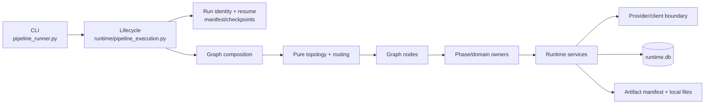
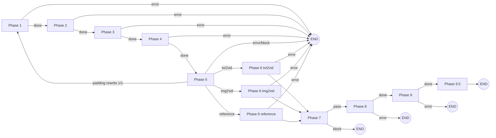

# HonCut 改造后架构规范

> 状态：Normative（后续开发与修复的架构事实源）
>
> 适用基线：`main`，重构验收提交 `1b01741` 及之后版本
>
> 更新日期：2026-08-28

本文定义 HonCut 当前生产架构、持久化与恢复契约，以及后续迭代修复必须遵守的边界。实现与本文冲突时，先确认生产执行路径；若实现是有意变更，必须在同一提交中更新本文和相应特征测试。

`docs/PIPELINE.md`、历史 redesign/roadmap/audit 文档只保留设计背景，不再作为模块所有权或 Phase 编号的依据。

## 1. 架构目标与不变量

HonCut 的核心目标不是“完成一次生成”，而是在长耗时、可能付费、可能崩溃的媒体任务中，保持可恢复、可审计、可去重和可验证。

以下规则不可通过降级路径绕过：

1. Graph State 只保存 JSON-safe 的标识、路径、状态和必要元数据；图片、视频、base64、日志正文、客户端与打开的句柄只存在于文件系统或 Runtime。
2. `RUN_MANIFEST.json` 绑定输入、配置、Provider、模型、代码版本和 `project_id`。身份不一致时禁止恢复；代码变化只能通过显式 `--accept-code-change` 和明确恢复边界接纳。
3. 已知旧版本必须确定性迁移；未知未来 State、checkpoint、task DB 或 Artifact schema 必须 fail closed。
4. 任何可能付费的视频提交都必须先进入 `GenerationTaskStore`，提交后立即持久化 Provider job ID；`submission_uncertain` 禁止盲目重提。
5. QA、重试、补拍与连续性回流都有有限次数和终止状态。缺失、损坏或不可验证的证据不能被解释为成功。
6. Artifact、checkpoint、cache 和任务复用不得跨越 `project_id`、run identity 或输入血缘。
7. 日志与 fingerprint 不得包含密钥、授权头或完整私有 Prompt；子进程参数必须使用数组，工作区路径必须阻止绝对路径越界、`..` 越界和符号链接逃逸。
8. CLI 参数、Phase 状态、主要输出路径、receipt 和 `pipeline_report.json` 保持兼容；破坏性修改必须提供版本化迁移与兼容测试。

## 2. 逻辑分层与依赖方向



规范依赖方向为：

```text
CLI → Lifecycle → Graph composition → Graph node → Phase/domain
    → Runtime policy/executor → Provider/client and Artifact storage
```

Schema、State 和纯工具是共享契约，但不得反向触发上层工作。低层模块不得导入高层模块来决定全局执行顺序。

| 关注点 | 唯一生产 owner | 约束 |
|---|---|---|
| CLI 参数与退出码 | `pipeline/src/pipeline_runner.py` | 只解析、规范化和分发，不实现 Phase 业务 |
| 运行生命周期与模式选择 | `pipeline/src/runtime/pipeline_execution.py` | 创建 run identity、选择 Graph/顺序路径、写总报告 |
| 唯一生产拓扑 | `pipeline/src/graph/workflow.py` | 只定义节点和边，不导入 Provider 或 Phase 实现 |
| 依赖装配 | `pipeline/src/graph/composition.py` | 把窄 Phase callable 注入节点，不创建第二套拓扑 |
| State 与迁移 | `graph/state.py`、`graph/migrations.py` | 生产写 canonical 字段；旧别名只在迁移适配器读取 |
| 文本/视觉理解 DTO | `pipeline/src/schemas/understanding.py` | Provider 使用原生 JSON Schema；返回值经 Pydantic 业务 DTO 验证后才能驱动身份、顺序或 QA |
| Phase 业务 | `pipeline/src/phases/phaseN/` | 文件、模型、媒体和领域规则归对应 Phase owner |
| Phase 耗时估算 | `pipeline/src/runtime/phase_estimates.py` | 只消费 canonical 结构与 Provider 工作量；不得用剧本文字长度或固定角色/镜头默认值伪装精确 ETA |
| 超时、重试、冷却与容量 | `pipeline/src/runtime/provider_policy.py`、`pipeline/src/runtime/llm_policy.py` | Provider、Graph 和 Phase 不得叠加重试；健康 LLM 长流由 idle 与 wall 两个时钟区分 |
| 长任务账本 | `pipeline/src/runtime/generation_tasks.py` | SQLite 幂等迁移、提交去重、恢复与终态证据 |
| 已批准角色资产注册表 | `pipeline/src/runtime/character_registry.py` | 显式项目库、精确规格匹配、QA/审批/内容哈希校验和不可变资产包；向量索引不拥有复用权限 |
| Artifact 血缘 | `schemas/artifact.py`、`runtime/artifact_manifest.py` | 严格 schema、内容哈希、父资产与原子 manifest |
| Provider 传输 | `runtime/video_provider.py` 与现有 clients/adapters | submit/status/cancel、能力和错误分类；不决定全局策略 |

`pipeline/src/phases/pipeline_core.py` 是 386 行的测试兼容门面，生产代码对它没有引用。禁止在其中增加新业务、恢复、Provider 或拓扑逻辑；新测试应优先向真实 owner 注入依赖，逐步消除门面。

## 3. 生产执行模型

### 3.1 入口与两种受支持路径

`pipeline_runner.py` 将稳定 CLI 参数传给 `runtime.pipeline_execution.run_pipeline()`。Lifecycle 在访问 checkpoint 前完成输入读取、配置解析和 run manifest 校验。

- 完整运行、无 `skip_phase`、新运行或可信 Graph 恢复：使用 LangGraph。
- `--phase`、`--start-phase`、`--end-phase`、`--skip-phase`，以及来自非 Graph checkpoint 的兼容恢复：使用顺序执行器。
- Graph 初始化或执行失败时直接返回 failed，不允许静默切换到顺序执行器重复副作用。
- 两条路径调用相同的 Phase owner、质量门、checkpoint 和报告契约；修复公共行为时必须同时验证两条路径。
- 人工故事板 review 已永久禁用；`auto_approve` 只是 checkpoint/CLI 兼容字段，两种取值都不能创建 Graph interrupt。

### 3.2 Canonical Graph



Phase 5 的路由优先级固定为：当前 receipt 明确写入 `correction.status=rewrite_scheduled` → Phase 1；否则任一 shot 的 `ref_type=reference` → reference；否则存在 storyboard image → img2vid；否则 txt2vid。`rewrite_scheduled` 只允许由下述 Provider padding 账本策略产生一次，顶层 State 保持 `running`，不能被普通 `status=error` 冒充。Phase 7 的 Graph 路由只做 pass/block，像素级修复和付费补拍由 Phase 8 的有限闭环拥有。除这个有版本、有计数的有限回边外，每条 Phase 成功边都是显式条件边；节点写入顶层 `status=failed/error/blocked` 后只能路由到 END，`Command(goto=END)` 不能与无条件静态成功边并存，防止失败 Phase 之后继续产生图片、视频或其他副作用。

Graph node 必须只完成三件事：读取 State、调用一个窄 owner、返回 State patch。节点不得直接读写媒体、运行 subprocess、调用网络/模型或实现重试。

流式 LLM 的 idle timeout 与 wall timeout 是两个不同合同：idle 只检测连续无 chunk 的停滞，wall 才是活动流的绝对安全上限。导演规划、事件提取和 adaptation 这类有界结构化长输出不得使用短于健康历史流的 Phase 本地硬墙；其限制由 Runtime LLM policy 提供，Phase 只选择工作负载 profile。超时后仍 fail closed，禁止在 Graph 或 Phase 外层盲目重提。

### 3.3 Phase 所有权

| Phase | 业务 owner 与输出责任 | 主要失败边界 |
|---|---|---|
| 1 | 文本解析、源事件发现、按 sequence 的导演意图、角色发现、`SEMANTIC_LEDGER.json`、时长缩放后的 `SCREENPLAY_PLAN.json` 与 canonical `STORYBOARD.json` / `CHARACTERS.json` | 输入/LLM/结构无效即停止；子阶段 checkpoint 可复用 |
| 2 | 分镜与 Pxx 图像资产、构图和端帧契约 | 生产图片或其验证证据缺失时 fail closed |
| 3 | 角色卡、四视图、单图四视图参考板、变体、身份锁定，以及显式项目角色库的精确导入/批准 | 生产模式要求真实四视图 QA；参考板只能由已验收四视图确定性派生；角色库证据缺失、篡改或冲突时 fail closed；dry-run 只写明确的 dry-run receipt |
| 4 | 原生 shot 目录与 `SHOT_META.json`、场景一致性、continuity plan、cinematic first-frame | canonical storyboard 不得为元数据物化而原地改写；Phase 4 不运行视频生成子进程 |
| 5 | storyboard QA、生成容量、variation/slideshow、监督与进入视频生成前的硬门 | C/D 或 blocking supervision 阻止 Phase 6；dry-run 不做像素/模型监督 |
| 6 | 视频生成与 continuity chunk 执行 | 所有长请求经过 Runtime task ledger；相同输入恢复不得重复提交 |
| 7 | 生产一致性检查与 Phase 8 质量所有权交接 | 结构/一致性阻断后结束，不在 Graph 内直接重提视频 |
| 8 | inventory、顺序复核、连续性裁决、逐镜像素 QA、有限补拍、转场、受审剪辑和时长闸门 | 补拍最多两轮；连续边界使用硬切；无法安全应用 trim/QA 时禁止 raw concat 降级 |
| 9 | ASR、音频/TTS/ducking、字幕、视觉后期、节奏编辑和最终编码 | 最终时长/编码失败即停止；可选 QA 必须在 receipt 中明确标记 |
| 9.5 | 成片交付 QA | 不通过则顶层 run failed，不交付伪成功 |

Phase 1 的时长合同采用三账本：`story clock` 记录一级 `Sxx` 与其二级 `Pxx` 共同表示的有效叙事时长，二者不得相加；`Provider request` 记录实际请求/计费时长；`padding/context` 记录 Provider 最低请求、尾段上下文或重叠中不属于新故事时钟的部分。每个 Pxx 必须分别持久化 `effective_story_duration_s`、`provider_request_duration_s` 与 `provider_minimum_padding_duration_s`，Runtime 按请求帧生成后规范化到 `expected_unique_frames`。Provider 的 8 秒/6 秒最低请求不得反向成为故事时钟的最低镜长或首次编剧的压缩阻塞条件。跨一级镜头的 bridge 是独立 Provider 请求开销，只进入请求账本；其可见部分按 `replace_boundary_handles` 替换等长边界把手。`honcut.material-budget.v4` 必须记录 nominal、ceiling、planned 故事时钟、Pxx 分区校验、内容请求与 padding、bridge 请求实际/规划区间、总 Provider 请求及比率。`max_material_padding_ratio` 与 `delivery_overrun_ratio` 的合法区间均为 0–25%；前者默认 25%，后者默认 0。欠时只允许两帧编码误差，不能用交付超时窗口掩盖素材不足。历史 v2/v3 只可迁移用于成本审计，不得作为当前 Phase 5 成功证据；历史 `1.3` 仍只作成本参考，不是容量硬上限。Phase 8 的安全变速区间是独立编辑合同，不得从 Provider 请求比率反推。

内容请求的 padding 损失率固定定义为 `content_provider_padding_duration_s / content_provider_request_duration_s`。单个短请求的 Provider 最低时长不可避免，免于该策略；存在多个 Pxx 请求时，上限由 `max_material_padding_ratio` 决定。Phase 1 的统一布局求解器必须在 nominal 到显式 delivery ceiling 的故事时钟、sequence 隔离、模型 Sxx/Pxx 时间片容量、逐时间片角色运动负载和 padding 上限内枚举可执行组合，目标依次为：保留必选事件、终局和连续因果闭包；最大化来源事实覆盖；选择相对 nominal 最短的完整交付时长；最少 Sxx/跨镜边界；最低 padding。减少 Sxx 只能把原内容段重装为同序 Pxx，禁止把原 7 个内容段直接截成前 2 个 Sxx 摘要。`continuity` 可在经布局账本证明可执行时为单个长 Sxx 使用最多 4 个 Pxx；`balanced`、`cut-driven` 与旧恢复仍保持 3 个上限。它只规划账本，Phase 5 仍以实际 `honcut.material-budget.v4` 作为硬安全门。首次命中 L1 `content_provider_padding_loss_exceeds_limit` 时，Phase 5 必须零补画生成 `honcut.screenplay-rewrite-request.v1`，持久化观察值、配置上限和 `screenplay_rewrite_attempt=1`，由 Graph 或顺序 Lifecycle 返回 Phase 1 并调用同一个布局求解器，禁止再从最大镜头数向下返回第一个可行解。rewrite request、`shot_policy` 与选中布局必须进入 layered adaptation fingerprint，禁止命中旧 beat/shots checkpoint 原样重跑。重编后 Phase 2～5 依据新 fingerprint 重建或复用各自产物，Phase 6 在新的 Phase 5 成功 receipt 前不得提交任何视频任务。该回流全局最多一次；第二次仍命中同一错误必须写 `rewrite_exhausted` 并 fail closed，禁止循环或第三次编剧。Graph 的次数以 `phase_results.phase5.correction` checkpoint 为事实源；顺序执行器在同一 Lifecycle 调用中携带相同版本化 request、策略和计数，两条路径必须产生一致布局与终态。

Event Extractor 必须为每条来源 micro action 输出角色、目标、动作类型、节奏、状态读写以及 `after/overlap/reaction_overlap/effect_of/sustained_during` 关系；代码校验同角色冲突、交互式攻防、因果引用和角色运动负载后写 `honcut.action-timeline.v1`。攻击与同步闪避/格挡必须位于同一 event 的 `reaction_overlap` 时间片；位移后抓取、控制后投掷、回合制反击与慢节奏检查/揭示保持串行。被动粒子、火花、碎片、玻璃震动和持续环境可附着时间片而不单独占故事时间，但来源索引和哈希必须永久保留。无法验证的模型关系只允许一次有界纠错，耗尽后在媒体费用边界前 fail closed。

`phase1_events.json` 是完整源事实账，记录 Event Extractor 从原文发现的全部 canonical 事件；它不得因交付时长而被覆盖、截短或重命名为生产结果。Adaptation 先生成 `honcut.duration-scaled-event-plan.v4` 的生产事件动作账，再在确定性修复与精确时长分配后写 `honcut.screenplay-plan.v7` 的 `SCREENPLAY_PLAN.json`：逐 beat 记录稳定 ID、单一 sequence、精确时长、`source_refs`、`omitted_source_refs`、来源动作索引、改编动作与生产 Director 投影，并分别汇总 source ledger 与 production ledger。v7 必须嵌入 `honcut.primary-shot-layout.v2` 与完整 timeline binding，记录策略、每个 Sxx 时长、Pxx 数量、逐 Sxx 时间片容量、逐时间片独立角色运动容量、跨 Sxx 边界、Provider 请求时长、padding 与目标函数裁决；shot 上的 `source_event_generation_unit_counts` 必须记录重复事件在各 Sxx 的非对称动作分配，使 `[8,6]` 这类布局不能在后续均分成 `[7,7]` 并悄悄多生成一个 Pxx。`SCREENPLAY_PLAN.json` 是新运行中 Sxx/Pxx 执行布局的唯一事实源；Adaptation 投影、capacity projection 和 Storyboard projection 必须逐字段与它相等，并在 Pxx 切分前写入 `honcut.primary-shot-execution-handoff.v2`，绑定 screenplay hash、layout hash、timeline binding hash 和 schema。Storyboard Generator 必须原样保留 `source_event_generation_unit_counts`；任一投影缺失、hash 漂移、逐镜时长/动作容量不一致或未来 schema 均在后续图片与视频费用发生前 fail closed，禁止重新推断、均分或回退到默认 3 个 Pxx。旧版只允许确定性迁移为 `cut-driven`，缺失的历史 Provider 账本不得伪造，仍以 canonical storyboard/material budget 为证据；未知未来版本 fail closed。除结构角色外，完整来源流最后一个具有可见叙事事实的事件必须作为 terminal outcome 锚点，即使 Event Extractor 将其角色标成普通 action/transition；生产账必须分别持久化 `terminal_outcome_source_event_ids`、包含结构角色和终局锚点的 `base_mandatory_source_event_ids`、`continuous` 闭包产生的 `causal_predecessor_source_event_ids` 及其并集 `mandatory_source_event_ids`。四者不自洽或任一必保事件被整体删减时 fail closed；容量不足时必须优先做来源索引约束的事件内动作压缩，禁止以删除结局换取时长。进入 Adaptation 前的 `screenplay_compression_required` 只表示完整源账需要时长缩放，不得在一个已经通过 sequence、动作容量、必保事件和精确故事时钟校验的生产账上继续充当最终失败状态；成功生产账的 canonical `action_capacity_status` 必须为 `fits_story_clock`，同时以 `source_action_capacity_status` 保留原始压力证据。零请求 dry-run 没有生产语义删减证据，仍只报告源结构容量并在估算需要压缩时 fail closed。

当完整事件账本超过交付故事时钟的可执行容量时，Phase 1 必须先由代码确定每个必保事件可承载的生产时间片数量，再让 Director 意图约束的 strict 结构化选择器只返回来源 generation-unit 索引和 `narrative_purpose` / `emotional_beat` / `director_alignment`；选择器不得改写、重排或创造动作，索引覆盖、数量、顺序与容量不匹配时 fail closed。`scene_setup`、`turning_point`、`dramatic_turn` 与 `consequence` 的事件事实、因果结果和至少一个原有可见时间片必须保留；任一必保事件若声明 `continuity_before=continuous`，代码必须沿同一 `sequence_id` 向前闭包到最近的 `cut` 边界，前置事件可以按来源索引做事件内动作缩放，但不得整事件删除。任一可选事件一旦进入生产 `source_events`，也必须满足相同前置闭包，禁止保留结果却删除连续原因。动作目标分配必须按可观察的 beat 占用数、逐 beat 时间片容量和尾槽负载做有界动态规划，状态空间受 `beat_count × max(per_beat_capacities)` 约束；禁止按事件动作数量做笛卡尔积穷举、把整个 Sxx 当成单个 Pxx，或以搜索状态上限误报无法装入。被省略的事件内微动作以来源索引和源动作哈希留在生产动作账。非关键事件仍只能通过生产剧本账与 shot 上的 `dropped_source_events` 整体删减，且不得进入生产 `source_events`、Pxx、Prompt 或媒体生成。`continuity` 为新运行默认策略：先保留可执行语义内容段并最大化生产动作容量，再最小化 Sxx 数、跨镜边界和 Provider padding；`balanced` 在同容量布局中优先接近 `ceil(duration / shot_duration)`，同分取更少镜头；`cut-driven` 完整保留旧短镜算法和 `shot_duration` 硬目标语义。前两种策略中的 `shot_duration` 只是软偏好。每个 Sxx 的时间容量必须按实际 Pxx 数量乘以模型 `max_temporal_slices_per_beat` 计算；单个时间片的独立角色运动贡献不得超过 `max_motion_contributions_per_slice`。两项能力必须从具体视觉模型 profile 读取，并在 Adaptation、checkpoint 恢复、Pxx 切分与 Phase 5 使用同一容量矩阵。Phase 1 直接持久化 `event/action/slice → Sxx/Pxx` 的精确非对称映射；后续只消费该映射及哈希，禁止再次均分、重装箱或调用旧 `_sequence_beat_plan()`。Pxx 只向 Provider 暴露当前时间片的 1–2 个动作及其附属效果；完整 Sxx 只提供时空、角色状态和连续性上下文，不得泄漏其他 Pxx 动作。同一时空、主体和因果链优先留在一个 Sxx，只有换场、跳时、主体切换或真实导演硬切才新增 Sxx。模型不得在仍有可用故事时钟容量时保留整事件删减；Phase owner 必须按标准化时间片确定性恢复仍可装入的事件，并重新校验 sequence、单镜容量与总 material duration。同一 sequence 的每个事件只能占据连续的 beat 区间，且按源事件顺序单调前进；同一事件可在完整时间片边界跨相邻 Sxx 并持久化确定性起止状态，后段事件不得提前出现、跨过前段事件或在后续回跳。Phase 5 必须 fail closed 校验 canonical 时间线、精确容量矩阵、故事时钟上限、Sxx/Pxx 等时、bridge 区间/把手以及持久化 material ledger；未知或旧 material-budget schema 不得解释为成功。

Phase 5 的全局动作覆盖必须以 `SCREENPLAY_PLAN.json` 的 production event lineage 为预期集合：`production_status=kept` 的来源 Action Unit 必须全部出现在 canonical storyboard，`whole_event_omitted` 只保留审计血缘而不得误报为生产遗漏；未知 screenplay/event-scaling schema 或不完整事件序列必须 fail closed。L3 多模态复核只接收 `honcut.phase5-l3-semantic-projection.v3` 的有界 prompt 投影：角色 canonical contract 去重一次，媒体只提供稳定 input index/character/shot/Pxx 映射；存在 Pxx 时，故事动作、起止状态和可见角色只读 Pxx，Sxx 只提供时空、灯光、镜头语言和转场上下文。L3 必须按 Sxx 拆成独立 strict DTO 请求，每个请求只允许报告当前镜头的 Pxx，输入只含当前镜头可解析的 canonical 角色参考、当前高细节分镜板和只作跨镜连续性上下文的全片总览；故事语义上下文只扩展到相邻镜头。无法从旧 storyboard 解析 canonical 角色 ID 时必须保守携带全部可用参考，不能静默跳过身份 QA。每次请求的局部 input index、Prompt 哈希和媒体哈希必须写入 `honcut.storyboard-qa-inputs.v2`，同时保留全局去重输入清单；禁止用一个全片超长 issue 数组重新引入结构化变量冲突。模型误把 `expected` 与 `observed` 相同或明确声明“无可见不匹配”的正向观察放入 `issues` 时，L3 owner 必须确定性剔除并在 layer receipt 中分别记录 raw、filtered 与 accepted 数量；含 `but/但/然而` 等反差且随后声明真实偏差的发现不得被该过滤吞掉。相同 Pxx 像素在相邻复核中发生 pass/block 翻转时，不得把单次抽样直接变成补画或放行权限；Phase 5 必须对该 Pxx 追加且仅追加一次同证据复核，以前次、当前与确认三票作逐 Pxx 两票裁决，并把像素哈希、三票和终态写入 `honcut.phase5-review-adjudication.v1` 收据。该确认由 Phase 5 owner 只针对争议 Pxx 运行窄 L3：媒体、合法输出 ID 和语义投影都不得包含非争议 Pxx、无关 Sxx、L1/L2/L4 或新的图片生成；请求 Prompt/输入媒体哈希写入独立 `phase5_review_adjudication_inputs.json`。确认请求不可用、像素在裁决期间变化或裁决次数耗尽时必须 fail closed，并原子写入 `phase5_review_adjudication_report.json`，保存脱敏异常、争议 ID、像素哈希、前后报告快照哈希和请求收据，禁止用随后重写的 canonical QA 报告丢失真实失败。只有用户显式 `--resume-from phase5` 才可恢复 `blocked_unavailable`：Lifecycle 与 Graph 必须调用同一 Phase owner，先验证当前 run 的输入血缘、快照和争议 Pxx 哈希，再只重做尚未形成第三票的窄 L3 确认，禁止重跑完整 QA、补画或 Seedream；证据变化、未知 schema、快照缺失或其他阻塞状态继续 fail closed。该恢复调用形成第三票后必须立即结束，不得在同一次调用跨越 Seedream 边界；若三票终态仍为 blocking 且原 correction family 为 `storyboard_previs`、仍有纠偏预算，下一次显式 `--resume-from phase5` 才可在再次校验输入血缘、裁决像素哈希、连续 attempt history 与同一 family 后，从 `attempts_used + 1` 继续 Phase 2 精确 Pxx 纠偏。该续跑不得重做第三票、重置或扩张预算、切换 correction family；历史裁决已被后续合法纠偏消费或预算耗尽时只返回持久化终态，禁止新开一轮。旧版失败若且仅若 correction history 明确为该不可用签名、不可变 `before` 归档与当前报告均存在且相同 Pxx 哈希可重建争议集合时，才可确定性生成待恢复收据，否则拒绝迁移。完整 `STORYBOARD.json`、`CHARACTERS.json`、Provider prompt、路径、哈希、receipt 和历史字段不得整包拼入模型 prompt；完整媒体输入清单仍单独落盘用于审计。Phase 5 自动纠偏每次运行只能选择一个 correction family：默认局部分镜补画只接受带明确 Sxx 的 blocking L3 `R1-R4` 作为权限；L4 只有 strict DTO 分类为 `SUBJECT_DUPLICATION`（以及兼容旧报告的 `ANNOTATION_CONTAMINATION`）、`evidence_status=validated` 且每个 `frame_id` 均有独立非肯定性 `frame_evidence` 时，才可授权 Phase 4 cinematic owner 局部重生精确帧及同镜后续引用依赖帧。该 L4 路径必须归档旧像素/收据、记录显式目标与依赖闭包、校验没有闭包外 Provider 重提，并且本轮不得再切换到 L3/PREVIS 补画；L4 通过后若 L3 仍阻塞，应结束本 correction family 而不是串行消费第二类图片额度。`STYLE_MISMATCH`、证据不完整或未知 L4 仍零补画返回 Phase 4；任何 L1 blocker 即使带有 shot ID 仍是 canonical 规划缺陷，必须零补画返回 Phase 1，禁止一边保留上游坏账一边消费图片额度。局部分镜补画只拥有 PREVIS 资产；调用 Phase 2 owner 时必须把 shot 级 QA issue 投影为每个目标 Pxx 独立的 `honcut.storyboard-panel-correction.v1` DTO，当前格的权威动作与终态只读 canonical beat，当前格可见错误只读同 ID 的 `panel_evidence`；跨格 `expected/observed` 只保存在收据作血缘，不得重新注入 Provider 动作指令造成变量冲突。Phase 2 的 Provider 投影不得包含 `panel_evidence.observed` 原文，也不得重复 DTO 中的 action/end state；它只按 `mismatch_type` 生成不改变 canonical cast、动作顺序与终态的正向约束，完整 expected/observed 继续留在 QA 与纠偏收据。`honcut.storyboard-panel-prompt` v2 对已有 canonical 角色参考只发送去重身份锁，不重复长角色描述；对 canonical 未明确要求伤亡的冲突格，在首个 Provider 请求即附加虚构、风格化、非血腥 PREVIS 编排合同，但不得删除、改写或反转 canonical 动作、攻守关系、武器激活和结束状态。角色或道具合同中的能力描述只锁身份和装备外形，不授权当前格激活发光、放电、攻击、护盾等效果，效果激活只读当前 beat 的 action/end state。纠偏权限与文件变更范围都必须精确到有非肯定性 `panel_evidence` 的 Pxx；同一 Sxx 内未命中的 Pxx 图片和 sidecar 必须按字节哈希原样保留，禁止为重组 Sxx 而重新提交。目标 Pxx 的纠偏请求只可携带 canonical 角色身份参考；上一 Pxx 和 Sxx 导演单格可能包含待消除的提前动作、旧终态或旧场景，不得在纠偏请求中作为视觉参考覆盖当前 DTO。调用 Phase 2 owner 后必须从当轮不可变归档按哈希恢复 Phase 4 已物化的 `storyboard_images/Sxx` cinematic P01 别名和收据，不得用 PREVIS 降级该视频边界别名，归档缺失、类型或来源不匹配时 fail closed。

L3 正向观察过滤还必须覆盖“规定动作序列已完整完成”这类明确完成结论；“未完整完成”等否定结论不得误删，含 `but/但/然而` 等反差并继续声明真实偏差的混合结论也必须保留为 issue。该规则基于结论语义，不得按具体剧本动作、角色或镜头 ID 建白名单。

Canonical 事件账本要求 `dramatic_turn=true` 当且仅当 `event_role=turning_point`。事件提取模型返回冲突组合时，Event Extractor 必须携带具体 schema 错误进行一次有界纠错；仍不一致则 fail closed，禁止把普通动作链提升为必保转折或静默丢失真实转折。改变该规范化规则必须升级事件缓存 schema。

Phase 1 的生产顺序固定为 `text_parser → Event Extractor → Director Planner → character discovery → Adaptation Engine`。Director 不得重新分场；`director_plan.json` 使用 `honcut.director-plan.v1`，必须按事件账本顺序对每个且仅一个 `sequence_id` 写入 `scene_goal`、`emotion_arc`、`visual_focus`、`spatial_intent` 与 `transition_intent`。Director 请求必须使用 Chat Completions 原生 `response_format=json_schema` 并通过 strict `DirectorPlanUnderstanding` DTO；JSON/schema 或 sequence 覆盖失败只能触发一次有界结构纠正，仍失败则 fail closed。Director 只说明“为什么这样拍”，不得决定镜头数量、景别、机位角度、运镜、焦段、光影或时长；这些具体字段仍由 Adaptation Engine 唯一拥有。sequence 缺失、重复、未知、乱序或任一意图为空必须 fail closed。Director 意图属于 adaptation 的语义输入，必须进入分层 checkpoint fingerprint；意图变化不得复用旧 beat/shots checkpoint。sequence 级原始 Director 意图可能包含随后被时长压缩删除的事实，只能保存在 `director_plan.json` 和 source fingerprint 中；生产 beat、canonical shot、监督投影与 Provider Prompt 必须改用 `honcut.production-director-intent.v1`，其 `scene_goal/emotion_arc/visual_focus/spatial_intent/transition_intent` 只能由该镜 `source_event_ids` 指向的 canonical 事件确定性投影。生产 beat 的 `who/where/what/reason/texture_keywords` 同样必须在确定最终 `source_events` 后由这些事件重新物化，禁止保留骨架模型基于完整 sequence 产生的自由文本。投影 schema、sequence 或 event lineage 不匹配时 fail closed，禁止把原始 sequence 文案整段复制到生产镜头而重新引入 `whole_event_omitted` 内容。

前述 body mechanics 确定性补全是 Director 请求前的代码 preflight，只完成已有 choreography beat 的少量制作字段，不属于 LLM 意图，不得改变来源动作或抢占 Adaptation 的镜头布局所有权。

Phase 4 物化 `SHOT_META.json` 时必须通过 shot 的 canonical `source_sequence_ids` 绑定 `director_plan.json` 中的 `speech_pacing`。一个 shot 只能绑定一个已知 sequence；禁止按 shot/scene 数组下标配对，防止一个 sequence 展开为多镜时把后续 scene 的节奏误写到同场镜头。旧的无 schema `scenes[]` Director 产物不能作为当前 Phase 4 成功证据。

Phase 4 cinematic first-frame 收据必须同时记录不含 L4 纠偏覆盖层的基础输入指纹和实际 Provider 输入指纹。某次 L4 拒绝已由收据中的报告哈希明确 supersede、而后续 Phase 5 报告已通过或不再拒绝该帧时，只要当前基础指纹与收据基础指纹一致，必须复用该纠偏成功帧并保留实际生成 Prompt，不得因纠偏文字从当前 Prompt 消失而再次付费生成；模型、尺寸、参考图、角色/场景合同或新的拒绝上下文发生变化时仍必须失效缓存。

项目视觉媒介使用独立的 `honcut.image-style.v1` 受控合同。新写入的 `visual-style.md` 为兼容格式 1.1，除自由风格描述外必须保存 `base_style` 与 `style_tags`；`base_style` 只能是 `photorealistic/cinematic/anime/donghua/3d_animation/game_cinematic/concept_art/digital_illustration/oil_painting/watercolor/ink_wash/shadow_puppet`。已知 1.0 文件可从完整风格文本按通用媒介词确定性推断，显式未知枚举必须 fail closed。Phase 4 与 Phase 6 只消费由该合同投影出的无剧情名词正向媒介锚点和负向漂移列表，不得让自由风格文案中的人物、地点或道具污染其他镜头；图片与视频 Prompt 必须携带同一 `base_style`。

Phase 4 生产路径必须使用本地 OpenCLIP 对导演单格按上述固定词表排名，并将完整排名、模型名、模型权重哈希与源图片哈希写入 cinematic first-frame 收据。排名实现仅移植 MIT `pharmapsychotic/clip-interrogator` 提交 `bc07ce62c179d3aab3053a623d96a071101d11cb` 的 custom `LabelTable` 语义，不加载 BLIP、艺术家或自由标签表。模型权重固定由 `pipeline/scripts/install_clip_style_model.py` 安装到 Git 工作区外并校验 SHA-256；缺失或哈希不符时在任何 Seedream 请求之前 fail closed。若导演单格的渲染媒介以明确分差落在项目允许风格之外，Phase 4 仍保存其 lineage 和分类证据，但不得把该像素作为 Provider 参考图；角色身份图不受该规则删除。CLIP 只拥有固定枚举分类和上游参考仲裁，最终成片首帧是否可进入付费视频仍由 Phase 5 L4 多模态证据裁决，禁止仅凭一次 CLIP 模糊排名放行或取代 L4。

Phase 1 的事件、角色、时长缩放动作选择与 Storyboard Prompt 请求必须使用 Chat Completions 原生 `response_format=json_schema`，并分别通过 strict `EventUnderstandingBatch` / `CharacterUnderstandingBatch` / `DurationScaledActionSelectionBatch` / `StoryboardPromptUnderstanding` DTO。所有结构化模型文本统一进入 `schemas/understanding.py::parse_structured_output()`：先保留标准 `json.loads` 快路径，只有语法失败时才允许 `json-repair` 修复单一文档中的标点或闭合分隔符，随后仍必须通过 strict Pydantic。统一 parser 必须拒绝前导/尾随 prose、第二个顶层对象、未闭合字符串、停在 `{` / `[` / `:` / `,` 的不完整值以及无法满足 DTO 的修复结果；Phase 不得自行扫描 JSON 片段、截断、拼接或绕过 schema。模型产生的 `who` 只是来源称呼，角色发现完成后必须确定性绑定到唯一 canonical `character_id`，生成 `honcut.semantic-understanding.v2` 的 `SEMANTIC_LEDGER.json`。v2 采用混合语言合同：原始 `source_excerpt`、来源称呼和对白逐字保留且不得由翻译覆盖；身份连接只使用语言无关的 `character_id` / `ref_id`；`entity_type`、`gender`、`role` 和来源语言只使用英文受控枚举。`男性/女性/male/female` 等性别属性称呼不是独立角色身份；只有同一来源账中存在唯一、等价且不共现的稳定人物称呼时，Character Discoverer 才可把属性称呼保留为该角色的 source alias，多候选或共现必须继续 fail closed。Provider 的语言化 Prompt 是可重建投影，翻译不得改变身份、事件顺序、动作血缘、时长或逐字对白。结构化 `body_action_choreography.performer` 是动作所有权证据：singular performer 缺失于 `who` 时，Event Extractor 必须在审计字段中记录并补入参与者集合；未知、代词或群体 performer 不得借此创建角色。舞蹈、格斗与武术事件的每个身体动作必须映射到结构化 choreography beat；一旦模型或上游声明任何人体 choreography，即使周围文案没有“格斗/舞蹈”标签也必须强制校验，`performer/technique/side/limbs/footwork/torso/weight_shift/direction/contact/end_pose` 必须全部是非占位的可执行值。身体动作需求以当前 `micro_actions`/`generation_actions` 账优先，`what/visual` 只在没有当前动作账时作上下文回退；模型误放进 body DTO 的武器撞墙、冲击波、灯光、玻璃、雨滴等物体或环境结果必须从 body score 确定性剔除，但继续原样保留在 canonical 动作账及其血缘中，不得因背景仍提及格斗而伪造人体字段或缺拍。`contact` 表示这一拍的接触状态而非强制命中：不含撞击、抓握、格挡、踢打等接触语义的位移或闪避若返回空值/`无`/`不适用`，必须规范为“无目标接触；身体保持既有支撑接触”；包含接触语义的动作仍须给出具体接触点，禁止借该规则伪造无接触。`side` 是生产编排而非来源剧情事实：模型提供具体侧别时原样保留；为空或含 `未明确/未指定/unknown` 时，Event owner 必须用稳定的执行者与当前动作指纹确定性选择左侧或右侧并明确标注“确定性导演编排”，同一输入重跑不得漂移，且不得把该选择反写为来源事实。Event Extractor 仍必须对执行者、动作索引、时间关系、动作覆盖和来源事实 fail closed；但当单个已覆盖 choreography beat 只缺不超过两个 `performer` 以外的生产编排字段时，不再为这些非来源事实触发第二次付费提取，而是写入 `body_action_director_repairs_pending`。Director Planner 必须在任何导演模型请求前确定性补全这些字段、重新验证完整 body contract，并把精确动作索引与补全字段写入 `body_action_director_repairs`；Screenwriter 随后重写 `phase1_events.json` 保存完成态。缺执行者、缺拍、未覆盖动作、每拍缺三项以上或补全后仍无效继续 fail closed，禁止把坏账推迟到 Phase 5。相邻连续事件若仅把同一人物退化为等价的人类描述词，可在来源没有“另一名/新角色”等引入证据时继承前一稳定身份；当前事件退化为短泛称而下一连续事件恢复具体身份时，只有该具体身份同时逐字存在于当前事件自身的 `source_excerpt/what/start_state`、且跨事件候选唯一，才允许前向回填并保存模型原始值和审计映射；无当前来源证据或多人候选必须 fail closed。连续动作中遗漏的受力/攻击对象只能在“前一事件 canonical 参与者、当前 `continuity_subject`、当前 `source_excerpt/what`”三处逐字证据一致时补入 `who` 并记录审计字段；拉远镜头等仅在 continuity subject 出现但当前画面未点名的角色不得提升为可见参与者。Event Flow 只裁决来源语义并行、因果与角色冲突，不得用具体视频模型的单次运动容量拒绝真实的同时发生关系；超载语义时间片由后续 timeline binding 拆成共享 `semantic_temporal_slice_id` 的相邻 Provider 执行子片。Segment cache 在复验前必须剥离 `body_action_contract`、ID、sequence 等规范化派生字段，只把原生 DTO 字段重新送入 strict parser，避免有效非空缓存因内部字段被误判而重复付费请求。上述规则属于事件缓存语义，当前 `EVENT_FLOW_SCHEMA_VERSION=27.0`。抽象角色词默认不是人物资产；只有源文本以代号、化名、姓名或昵称显式声明时，角色 owner 才可基于保存的 `source_excerpt` 将其提升为稳定身份，禁止为具体剧本标签建立白名单。不同序号明确区分的来源身份即使从未在同一事件共现，也必须视为互斥 canonical 角色；模型将其合并、遗漏或互作 aliases 时，Character Discoverer 必须在同一次有界结构化纠错循环内拒绝并要求重新输出，耗尽后 fail closed，禁止确定性伪造人物描述。该角色上下文/回验合同当前为 `CHARACTER_CONTEXT_SCHEMA_VERSION=11`，旧角色缓存不得复用。下游镜头、角色参考、连续性锚点和视觉证据以 `character_ids` 为身份事实源，名称只作展示；无法绑定、多重绑定或 canonical ID 缺失必须在 adaptation 和付费边界之前 fail closed。

来源明确要求 `one_take` 时，事件 owner 必须同时保留单一 screenplay sequence 与下游移动摄影桥接合同。来源只要求单一、连续、按时间顺序推进的 `single_sequence` 时，事件 owner 必须合并模型误报的段落 cut，但不得把它升级成一镜到底或强制生成摄影桥。两种模式遇到来源中的真实回闪、次日或其他叙事时空跳跃都必须保留硬边界；否定表达不得触发任一模式。

事件级 `source_excerpt` 明确声明同一时刻并行完成的复合动作时，该源文本证据优先于 Event Extractor 模型返回的 `atomic` 标签；冲突必须确定性修正并写入原因。`最后一名/位/只/辆` 等实体序数短语不是动作时间推进，不得抵消同一事件的明确并发合同；`最后抬膝`、`随后`、`最终` 等真实阶段词仍阻止错误合并。改变该优先级或消歧规则必须升级事件缓存 schema。

相邻连续事件存在唯一“具体身份→同职业/类型短泛称”候选时，Event Extractor 必须确定性继承相邻具体身份并保留模型原始 `who` 供审计。后一事件除该泛称外多出的参与者只能是前面同一连续 sequence 已建立的身份；若出现尚未建立的新参与者，或来源明确引入“另一名/新的/第二名”及等价英文新参与者，则不得合并。多人候选与跨 sequence 情况不得猜测。改变这项跨事件指代规范化规则必须升级事件缓存 schema。

全局角色一致性、摄影、风格和负面约束属于项目级 Prompt/视觉风格合同，不占故事时钟，也不得被解释为 `scene_setup`、`character_state` 或 `transition`。Event Extractor 必须在进入 adaptation 前确定性排除只含此类指令且没有剧情动作/台词的记录；当模型的 `source_excerpt` 只摘录该段中的局部视觉短语而丢失“全程/必须/禁止”等范围词时，若完整源段落仍确定为制作指令且该段所有抽取记录均无动作/对白，也必须整体排除。含真实剧情动作或对白的混合段落不得因此整段删除。改变这项分类规则必须升级事件缓存 schema，防止复用旧的时间线事件。

Phase 1 新运行的骨架账本必须直接消费 duration plan v4 的 `sequence_beat_plan`、`generation_action_unit_capacities_per_beat`、`source_event_generation_unit_counts_per_beat` 和 `timeline_layout_binding`。代码逐 beat 固定 sequence、来源事件、非对称事件执行子片数量、时长、Pxx assignment 与容量；骨架模型只返回景别、机位、运镜、光影、构图和视觉节奏，不得返回或改写来源、动作、删减、时长和容量字段。零故事时间的环境、姿态和持续状态必须按来源顺序附着到同 sequence 最近的后继执行事件，否则附着到最近前驱；完全不存在执行事件时，按来源顺序稳定分布到该 sequence 的 Sxx。它们写入 `zero_story_time_attachments`，不增加时间片或 Provider 容量。新运行的骨架构建、checkpoint 复核和事件恢复不得调用旧 `_sequence_beat_plan()` 或二次装箱；该函数仅可服务缺少 canonical duration/timeline artifact 的历史迁移。任一 beat 字段、assignment 数量、sequence、事件总量或 hash 与 canonical 向量不一致必须在媒体费用边界前 fail closed。

Adaptation Engine 是具体镜头语言的唯一 owner。除 `shot_size`、`camera_movement`、`lens_mm`、`lighting_key` 等既有字段外，canonical shot 必须写入受控 `camera_angle`（`eye_level/low/high/dutch/over_shoulder/aerial/bird/worm`）；Director 意图不得预选该值。下游 Storyboard、二级 Pxx（当前 `honcut.secondary-storyboard.v16`）、Phase 4 元数据与生成 Prompt 只能保留或翻译这个 canonical 值，不得再次推断角度。每个 canonical shot 必须按 `source_events` 顺序持久化 `source_event_casts`，并以 `source_action_unit_refs[{source_event_id, action_unit_id}]` 保存 AU 的强类型事件归属；Storyboard Generator 必须原样复制这些结构化血缘，不得通过字段白名单丢弃。新 v7 运行的 Pxx planner 必须直接消费 layout 中逐 Sxx 的 `content_beat_counts`、`effective_story_durations_s`、`provider_request_durations_s` 与 `generation_action_unit_capacities`，生成数量必须与声明精确相等；每个 Pxx 与 planning receipt 都必须写入同一 `primary_shot_layout_sha256`。只有缺少新 handoff 的历史 `cut-driven` artifact 可以继续使用确定性的 3-Pxx 推导。每个 Pxx 的 `micro_actions`、`generation_action_units`、`source_event_ids`、`source_action_unit_ids` 与 `character_ids` 必须从同一个 generation-unit bucket 派生；`ledger_indexes` 决定完整来源动作账的连续分区，并把不消耗动作容量的镜头运动或环境状态留在相邻 canonical bucket，禁止分别切分这些数组后再按位置拼接。携带 AU 但无 GAU 的静态、出现或发现事件不增加动作容量，必须按事件顺序归入相邻 canonical bucket，并从 `source_action_unit_refs` 恢复 AU 和角色血缘，禁止从扁平 AU 数组猜测。隐式动作继承对应事件 cast；二人事件保留双方；多角色事件中的 action unit 若显式点名严格子集，只投影该子集，禁止把同一来源事件中尚未执行本格动作的其他角色及其道具提前带入 Pxx。Sxx 级角色全集始终只是上限。来源事件、动作单元、角色 ID、ledger index 缺失/重复/越界、分区交叉或血缘不一致必须在 Phase 1 fail closed。Phase 2 只接受当前 v16 canonical cast；v11 仅可走既有显式可见事实迁移，已知可能漏掉隐式主语、按事件过度扩张角色或丢失 AU 事件映射的 v12/v13/v14 与未知版本即使带有 `character_ids` 也必须 fail closed。生产代码只写 v16 canonical 字段。

Phase 5 的 L3 视觉审查使用 `honcut.phase5-l3-semantic-projection.v3`。角色可见性必须按 Pxx 的 canonical `character_ids` 投影，显式空数组代表该格没有具名角色；存在 `storyboard_beats` 时，Sxx 级 `who/character_ids/participant_refs/what/visual/source_events/director_intent/start_state/end_state` 不得进入 L3 语义投影并覆盖格级角色、动作或状态合同，Sxx 只保留环境、时间、灯光、镜头与转场上下文。按整镜附带的 canonical 角色参考图只用于该镜内相关角色的身份比较，不构成角色必须出现在每个 Pxx 的证据；只有没有 Pxx 的迁移期 legacy shot 才可回退到 Sxx 级剧情字段。

当 duration-scaled event plan 在同一来源事件内仅保留部分 micro action 时，未选择的动作只能保留在 `production_action_selection`、来源哈希和审计账中。生产 beat 与 canonical shot 的 `what/visual/texture_keywords`、`honcut.production-director-intent.v1` 以及后续 QA/Provider Prompt 只能重新投影已选择动作；禁止从来源事件的宽泛 `what/visual` 或 sequence 级 Director 文案恢复被省略动作。选择索引、生产动作和来源血缘不一致时必须 fail closed。

Phase 1 的 adaptation 对任意事件数量都固定执行分层骨架与分批镜头展开；生产路径不存在按事件数回退为单次 Prompt 的分支，也不得通过环境变量重新启用旧单次调用路径。分层 checkpoint 是唯一可恢复的 adaptation 中间状态；当前 schema 为 `honcut.layered-adaptation.v18`，fingerprint 必须包含 `shot_policy`、`honcut.primary-shot-layout.v2`、duration plan v4、action timeline、timeline binding（含零时事实附着）与 rewrite request。旧版不得跨导演意图、生产 Director 投影、机位角度、生产事件动作账、生产剧本账、语义容量、连续前置闭包、布局策略或事件顺序规则复用。

Phase 间调用原则上通过 Graph/Lifecycle。唯一允许的业务闭环是已建模且有限的修复路径，例如 Phase 8 调用注入的 Phase 6 生成 callable；该依赖必须可测试注入，并在所有递归轮次中保持一致。

新运行的 canonical 媒体默认值是 `media_profile=480p`。Graph 与顺序执行器必须把该字段显式传给共同的 Phase 6 owner；Phase 6 再把它解析成 Agent Plan 顶层 `resolution`，同时写入 generation fingerprint 与 `GenerationTaskStore` payload。当前 Agent Plan 默认视频模型名固定为精确字符串 `doubao-seedance-2.0-fast`，不得使用按量 API 的日期版本 ID 或错误的全连字符拼写；模型或分辨率变化必须形成不同任务身份，Fast/Mini 请求超出 480p/720p 时在提交前 fail closed。

Phase 8 接受 `[nominal, ceiling]` 内已经通过 canonical 时间线审核的素材，不得为了回到 nominal 破坏性尾裁；Phase 9 同时校验已审核时间线与声明窗口，并在 delivery receipt 中记录 nominal、ceiling、planned、actual 及其差值。bridge 只消费独立素材账，必须绑定上一时间片 `end_state`、下一时间片 `start_state`、timeline assignment ID、binding hash 与真实主镜头首尾帧，不得重复剧情动作或提前泄漏下一 Pxx。

Seedream 的 `optimize_prompt_options.mode=standard` 是传输参数，不是内容安全、负向约束或截断 owner。Phase 2 必须把该值写入 manifest 与 Pxx sidecar 供验收核对；不得通过改成未知模式、依赖 Provider 自动改写或在 client 传输层截断 Prompt 来修复安全拒绝。

## 4. State、身份与恢复

### 4.1 Canonical State

新运行必须先构建严格的 `GraphRunConfig`，再由 `initial_state_from_config()` 生成 `HonCutState`。当前 State schema version 为 3。

Canonical 字段包括：

- 身份与配置：`state_schema_version`、`run_id`、`run_fingerprint`、`project_id`、输入、时长、`shot_policy`、`max_material_padding_ratio`、`delivery_overrun_ratio`、媒体配置和恢复参数。
- 领域元数据：storyboard、characters、shot IDs，以及 QA/一致性摘要。
- Artifact 路径：`assembled_video`、`final_video`；不包含媒体内容。
- 编排元数据：`phase_results`、`completed_phases`、`current_phase`、`status`、结构化 `errors` 与有限尝试计数；Phase 5→1 padding 重编次数保存在 `phase_results.phase5.correction.screenplay_rewrite_attempt`，不另建旁路状态。

`text/duration/shot_duration/transition_duration/shots/videos/quality_report/error` 是只读旧别名。生产 composition 会在 checkpoint 前移除这些字段；新代码不得继续写它们。

### 4.2 Run identity

`RUN_MANIFEST.json` 是恢复身份的前置条件，绑定：

- 输入文本 SHA-256；
- 规范化后的配置与 `project_id`；
- Provider、模型和项目视频规格；
- Git commit 与源码内容形成的 code version；
- 由上述语义生成的稳定 `run_fingerprint`。

新运行不得复用包含另一 run 产物的输出目录。恢复时，输入/配置/项目身份变化一律拒绝；显式接受代码变化只改变被批准的代码历史，不改变原始 run fingerprint。

`shot_policy`、`max_material_padding_ratio` 与 `delivery_overrun_ratio` 都是不可变运行身份的一部分，并进入 Graph State、resolved config、`RUN_MANIFEST.json`、checkpoint 和 fingerprint。新运行默认 `continuity/0.25/0`；旧 State/manifest 缺少 `shot_policy` 时只能确定性解释为 `cut-driven`，缺少两个时长容差字段时迁移为 `0.25/0`，保持原 run fingerprint 与历史镜头布局。显式改变历史值仍属于配置变化，必须拒绝普通恢复。

### 4.3 恢复证据优先级

恢复按以下顺序决策：

1. 验证 `RUN_MANIFEST.json`、`run_fingerprint`、`project_id` 和代码变更历史。
2. 优先读取以 run fingerprint 为 thread ID 的 Graph SQLite state。
3. 兼容读取 `pipeline_run` thread 的 stage SQLite state。
4. 若无可信 SQLite state，读取版本化 `checkpoint.json`。
5. 对选中的 completed phases 应用 `checkpoint_phaseN.json` receipt；stale/failed receipt 会截断该 Phase 及下游完成状态。
6. Phase 6 恢复继续以 `runtime.db` 的 Provider job 状态和输出哈希为事实源，绝不因 Graph/JSON 缺口盲目重提。

`--resume-from phaseN` 必须先验证上游 Artifact，然后将目标 Phase 及全部下游 checkpoint/receipt 标 stale。SQLite checkpointer 初始化失败可以让新 Graph 以无 checkpoint 模式运行，但已存在且不可信的恢复证据不能被忽略。

## 5. Provider 与持久化任务

`VideoProvider` 的窄协议是 `submit`、`status`、可选 `cancel`、capabilities 和规范化错误。现有 Seedance/Bridge 客户端由 Runtime executor 适配；Phase 不得自行组合嵌套重试。

一条视频任务的生命周期为：

```text
immutable payload + fingerprint
  → enqueue/active dedupe
  → atomic claim
  → provider submit
  → persist provider_job_id + endpoint
  → poll/download/validate
  → register ArtifactRef
  → succeeded
```

任务规则：

- `runtime.db` 使用 WAL 和 `PRAGMA user_version`；当前 schema version 为 2，迁移只能增量且保留旧记录。
- active dedupe key 至少包含 run、task type、resource 和 Provider；已存在 active task 时 payload 必须字节语义一致。
- successful reuse 要求 Provider、payload、`input_fingerprint`、文件存在性、媒体有效性和已记录哈希全部匹配。
- claim 后未确认是否提交的进程中断进入 `submission_uncertain`；只能恢复轮询或由人工/确定性证据裁决，不能创建第二个付费请求。
- 已持久化 job ID 的任务只有在 Provider 明确报告 terminal failure 时才能标 failed。
- timeout、poll deadline、rate-limit retry、backoff、cooldown 和 capacity 只由 Runtime policy 拥有。Runtime 必须区分可恢复的瞬时 429/burst 与包含明确重置窗口的固定额度耗尽；后者须保留 Provider 原始重置时间并立即 fail closed，禁止退避重试。未知、认证、moderation 和 submission-uncertain 错误不自动重试。
- Provider 响应先通过 Pydantic envelope 验证；错误信息只保留安全摘要，不落完整响应或密钥。

## 6. Artifact、Prompt 与 Cache 血缘

本地文件系统仍是媒体内容存储；`ARTIFACT_MANIFEST.json` 是每个 run 的严格元数据索引，不引入对象存储或外部数据库作为正确性前提。

`ArtifactRef` 至少记录 schema version、artifact/run/project ID、类型、内容 SHA-256、相对路径、生产节点/任务、父资产、可选语义 fingerprint 和创建时间。注册与读取规则如下：

- 路径必须位于 run 目录内并使用相对 POSIX 表示；
- parent ID 必须存在、唯一且不能自引用；
- manifest 身份必须与 `RUN_MANIFEST.json` 一致；
- 注册时校验实际内容哈希，读取 lineage-sensitive 产物时再次验证；
- manifest 通过同目录临时文件、`fsync` 和 `os.replace` 原子更新；
- 跨项目、缺失父资产、哈希不匹配、未知版本或 provenance 冲突全部 fail closed。

跨 run 的角色复用默认关闭，只能通过稳定 CLI 参数 `--character-library-dir` 显式启用。该目录必须与当前 run 目录完全分离；Lifecycle 把规范化绝对路径写入不可变 `RUN_MANIFEST.json`，Phase 3 从该清单读取，禁止从环境变量、工作区扫描或最近使用记录猜测角色库。`runtime.character_registry` 的普通 SQLite `characters.db` 只作为审批元数据事实源，图片和 JSON 继续以不可变文件资产包保存。数据库 schema 使用 `PRAGMA user_version`，未知未来版本、无版本旧表、项目身份不匹配或审批/资产哈希变化全部 fail closed。

自动复用只允许同一 `project_id`、同一 canonical `character_id` 和同一版本化静态角色规格 fingerprint 的 `canonical_approved` 资产包。Phase 3 的 A 级只是必要条件；四个 canonical 视角、逐视角 QA receipt、确定性 2×2 参考板 receipt、当前角色卡合同、审批单和每个文件 SHA-256 必须同时有效。命中后先把完整资产包按哈希导入当前 run，再由共同 Phase owner 继续质量门；相同规格出现不同已批准像素时禁止任意挑选并 fail closed。含状态变体的角色在 v1 不提升、不自动复用，避免把剧情状态误当静态身份。

`sqlite-vec` 可在后续版本作为从已批准库中产生候选的可重建相似度索引，但不得成为资产、审批或哈希事实源，也不得直接触发自动复用。任何向量候选仍必须经过项目范围、精确规格、QA、审批和内容哈希裁决；本版本不创建向量表、不下载 embedding 模型，也不把相似角色匹配接入生产决策。

付费生成 fingerprint 固定包含 Prompt 模板 ID/版本、Prompt 内容哈希、Provider/模型 ID 与版本、语义参数和输入 Artifact 哈希，并递归排除 credential 字段。Cache key 固定包含：

```text
project_id + run_id + input lineage + semantic generation fingerprint
```

Seedance 2.0 最终提示词的生产 owner 是 Phase 6 `video_generator.build_video_prompt()`；带 `[honcut-video-generation-contract-v2]` 的完整合同必须由模型 router 原样透传，router 不得重排、摘要或追加重复元数据。组装顺序固定为：参考素材/精准主体 → 按事件顺序的动作细节 → 场景环境与光影 → 单一主运镜 → 视觉风格/画质 → 输出约束。重要主体和素材绑定必须前置；不得使用 `0–3 秒`一类精确子镜时码，不得用抽象情绪替代可见表情/呼吸/重心变化，不得在一个镜头同时指定多种主运镜。台词、音效和音乐分别使用 `{}`、`<>`、`（）` 标记；除非剧本显式要求可见文字，必须明确约束无字幕、无 Logo 与无水印。真实输出分辨率只由 `media_profile` 经 Runtime 映射为 Provider 参数，提示词只描述“高清细节”等视觉质量，不得用 `4K` 文案覆盖或暗示与请求参数不同的分辨率。

Seedance 在线请求中的所有图片和视频输入素材必须先上传 TOS，再以签名 HTTPS URL 写入 `content[].image_url.url` 或 `content[].video_url.url`；禁止内联 Base64/data URL、本地路径以及 TOS 失败后的纯文本降级。素材入口在读取完整文件和上传之前执行 Seedance 媒体规格预检：图片须满足官方格式、`[300, 6000]` 边长、`[0.4, 2.5]` 宽高比和小于 30 MB；视频须满足 MP4/MOV、H.264/H.265、`[24, 60]` FPS、`[2, 15]` 秒、官方像素面积范围和不超过 200 MB。图片压缩只在接近 30 MB Provider 上限时发生，先保留分辨率调整 JPEG 质量、最后才逐级缩放且不得低于 300 px；禁止沿用 300 KB 目标破坏角色、动作和纹理细节。Provider 边界必须再次验证 URL 的 scheme、配置 bucket/endpoint、TOS4 credential scope、签名字段和有效期，普通公网 HTTPS 或另一 bucket 的 URL 不能解释为已完成的 TOS 上传。

TOS 媒体对象采用内容寻址键时，basename 必须精确等于实际上传 payload 的 SHA-256。Transport 可先用同一凭据签名 HEAD；只有配置 bucket 内对象存在、`Content-Length` 一致且远端可选 `x-tos-meta-honcut-sha256` 不冲突时，才可跳过重复 PUT 并签发新的短期 GET URL。显式业务对象键、长度/哈希不符、HEAD 非 200 或无法验证时仍走权威 PUT；该复用不是 retry，也不得把未确认对象解释为成功。

Provider 生成结果仍从返回 URL 直接下载并按 Artifact 合同落盘，不要求同步到 TOS；只有当该结果随后被用作延长、编辑或参考生成的输入素材时，才在下一次提交前上传 TOS。提示词中的“图片 N / 视频 N”按 `content[]` 中同类媒体的真实提交顺序编号；任一媒体上传缺失或失败时，必须在 Provider 提交和付费任务之前 fail closed，不能删除该媒体后重排编号继续提交。`role=first_frame/last_frame/reference_image/reference_video` 仍是媒体控制语义的事实源，编号只负责 Prompt 引用。

Seedream 图片请求的唯一传输 owner 是 `clients/seedream_client.py`，Phase 1–4 只拥有各自的导演板、Pxx、角色参考和 cinematic first-frame 语义。HonCut 的 Agent Plan 图片合同固定使用专属 `/api/plan/v3/images/generations`、`ARK_AGENT_API_KEY` 与精确模型名 `doubao-seedream-5.0-lite`；不得把按量模型 ID、按量 Base URL 或 `ARK_API_KEY` 混入请求。新图片默认使用 `2K` 档位，单图非流式输出固定为 PNG、无水印、`sequential_image_generation=disabled`、`optimize_prompt_options.mode=standard`。显式 WxH 仍可用，但必须在 Provider 调用前满足 5.0 lite 的总像素与宽高比范围；生成一张输出时最多接收 14 张参考图，使输入图与输出图总数不超过 15。

Lifecycle 与各 Phase 的 ETA 由 Runtime `phase_estimates` owner 生成。Phase 1 尚未写出 canonical `CHARACTERS.json` 与 `STORYBOARD.json` 时，只能声明全程工作量待结构化，不得再以固定“三个角色、十个镜头”承诺总耗时。结构化工作量 `honcut.pipeline-workload-estimate.v1` 必须分别计数缺失的角色四视图、身份道具细节板、有效变体、Pxx 格、Sxx 总板与 cinematic first-frame；图片阶段以实际 `SEEDREAM_MIN_INTERVAL` 乘请求数形成基线。续跑估算只包含 CLI 选中且未由可信 checkpoint 完成的 Phase。Phase 5 基线与最多三轮配置上限内的全目标 Pxx/Sxx 补画必须显示为有界区间，不能把“无纠偏”历史均值冒充唯一 ETA。该估算是可观测性收据，不改变 Provider 请求、缓存或重试决策；缓存命中可令实际耗时低于基线，Provider/QA 失败也不得因 ETA 而被解释为成功。

多参考图的职责绑定由共享模板 `honcut.seedream.reference-contract` v2 在 Phase 图片组装边界按真实输入顺序前置为 `Image 1`、`Image 2` 等；角色身份、上一故事格、导演单格和上一 cinematic 帧不得交换职责。上一故事格只提供仍成立的场景事实、相对空间关系、机位轴线和画面方向，不得要求模型保留 completed pose 或动作进度；后续 Pxx 必须按当前 beat 推进到新的动作终态。Phase 收据必须记录模板 ID/版本、实际 Provider Prompt SHA-256、参考图顺序/角色和只含长度/哈希的 guidance 指标。官方 300 个中文字符/600 个英文单词是效果建议而非 API 硬限制；Transport 只能观测并报告超限，不得截断身份、动作、纠偏或连续性合同。Provider 的同步响应必须先通过严格 envelope 校验，24 小时 URL 产物须立即下载、验证为可解码图片并原子落盘；损坏、空数组、同时缺失/同时出现 URL 与 Base64 均 fail closed。

Phase 3 的四张 canonical 角色图 `face_closeup/full_body/side/back` 继续分别生成并逐视角 QA，它们是身份一致性和视角真实性的事实证据，不得用一张模型直出的拼图替代质检。四图通过后，`tools.character_reference_board` 必须在本地确定性派生一张无文字、无边框的 2×2 `reference_board.png`，固定顺序为左上面部特写、右上正面全身、左下侧面全身、右下背面全身；`honcut.character-reference-board.v1` 收据绑定四张源图哈希、布局、输出哈希与角色 ID，派生过程不得产生 Provider 请求。Phase 2/4 的图片角色参考、Phase 5 L3 身份复核和 Phase 6 全模态参考输入对每个角色最多携带这一张参考板；`identity_detail` 和显式有效变体只按各自合同另行携带。

Seedance 2.0 普通主镜头使用固定的全模态参考合同：所有输入图片都写成 `role=reference_image`，`content[]` 中第一张图片必须是 Phase 4 物化到 `storyboard_images/Sxx.png` 的 P01 单格电影质感渲染图，随后才是该镜实际出镜角色的四视图参考板和其他有明确职责的参考图；Prompt 必须按真实提交顺序使用“图片 N”引用，并显式写出“首帧为图片1”。这是官方“全模态参考通过 Prompt 间接指定首/尾帧”的软首帧语义，使 cinematic 构图与角色身份能在同一请求中共同生效。不得把普通主镜头改回只传 `first_frame`、把角色参考降成纯文本，或混用 `first_frame` 与 `reference_image`。只有需要严格端点像素约束的 FLF2V 与跨镜 bridge 才使用 `first_frame/last_frame`，且该请求不得混入角色参考媒体。原始导演总板裁切格、Pxx PREVIS、九宫格、文字标注和箭头仍不得直接进入视频；参考板也不得充当图片1或成片首帧。该合同依据火山方舟《Doubao Seedance 2.0 系列教程》的全模态参考说明，改变图片角色、提交顺序或 Prompt 编号规则必须同步更新本规范与零请求特征测试；把普通主镜头恢复成 strict `first_frame` 属于架构回退，而非兼容修复。

同一 Sxx 的二级 Pxx 必须对齐火山方舟的“全模态参考 / 延长视频 / 生成多个连续视频”合同：P01 使用上述全模态参考；P02 以后把上一 Pxx 的已完成视频尾段作为 `role=reference_video` 的“视频1”，Prompt 以“向后延长视频1”起句，并可携带按真实 `content[]` 顺序编号的当前 Pxx 单格、身份板与有序尾状态帧，禁止重新入画、重播或状态复位。连续生成请求必须设置 `return_last_frame=true`，该请求字段必须进入任务 payload 与 generation fingerprint 作为可审计的连续视频能力；HonCut 仍以下载完成的真实视频解码尾帧作为下一步的本地血缘证据，避免 24 小时 Provider URL 过期后无法恢复。跨 Sxx bridge 只使用上一主镜真实尾帧和下一主镜真实首帧，分别提交为唯一的 `role=first_frame` / `role=last_frame`，`ratio=adaptive`，Prompt 只描述两端之间的过渡且不得重复两侧剧情或携带任何 `reference_image/reference_video`。该合同分别依据[Seedance 2.0 系列教程](https://console.volcengine.com/ark/region:cn-beijing/docs/82379/2291680?lang=zh)和[视频生成教程](https://console.volcengine.com/ark/region:cn-beijing/docs/82379/2298881?lang=zh)；主分镜、二级连续镜与 bridge 之间禁止互换媒体角色。

Seedance 2.0 Provider 提交前必须执行官方“使用限制”预检：输出时长 4–15 秒；全模态参考图片最多 9 张，参考视频最多 3 段且总时长不超过 15 秒；图片边长 `[300, 6000]`、宽高比 `[0.4, 2.5]`、单张小于 30 MB；参考视频为 MP4/MOV、H.264/H.265、`[24, 60]` FPS、单段 `[2, 15]` 秒且不超过 200 MB；请求体不超过 64 MB。Prompt 引用素材必须使用同类媒体在 `content[]` 中的一基编号“图片 N / 视频 N / 音频 N”，不得使用 Asset ID 或发生上传后重排。任务记录只保存 7 天、结果 URL 只保存 24 小时且最多下载 100 次，因此 Runtime 必须在成功后立即原子下载并登记 Artifact；恢复只信本地产物哈希与任务账，不依赖过期 URL。

Phase 2 的 Pxx、模型绘制 Sxx 九宫格与跨一级镜头 bridge 都必须在相同语义输入的普通重入和 Phase 3 character-lock 刷新中复用。Sxx cache 至少绑定当前 Prompt SHA-256、模型、尺寸、宽高比、图片请求合同版本、结构化 Phase 5 纠偏 attempt/issue（如有）、可解码文件、内容 SHA-256 与完整 3×3 grid receipt；任一项变化或损坏时只重生成该 Sxx，不得连带重提已验证的 Pxx。同一纠偏 attempt 的崩溃恢复可复用，而新的有界纠偏 attempt 必须形成不同语义 fingerprint 并授权一次重画。未知未来 `SHOT_STORYBOARDS.json` schema 必须在覆盖旧证据前 fail closed。定向 Phase 5 补画仍只保留非目标 Sxx，目标镜按纠偏语义产生新 fingerprint。

多模态理解的唯一传输 owner 是 `clients/ark_multimodal_client.py`。它固定让 `ARK_AGENT_API_KEY` 与 Agent Plan `https://ark.cn-beijing.volces.com/api/plan/v3/responses` 成对使用 Responses content schema：图片、视频、PDF、音频分别写为 `input_image.image_url`、`input_video.video_url`、`input_file.file_url`、`input_audio.audio_url`，文本写为 `input_text`；不得把 Agent Plan 凭证发往标准按量 `/api/v3`，也不得把 Chat `image_url` schema 套到理解请求。理解不得读取 Honcho 使用的 `ARK_API_KEY`。本地理解素材也必须先通过 TOS owner 做格式、容量、尺寸/时长预检并上传到配置 bucket；图片 URL 小于 10 MB，视频/PDF URL 小于 50 MB，音频不超过 25 MB 且不超过 120 分钟。默认理解模型为 `doubao-seed-2-0-lite-260428`，图片使用 `detail=high`，视频抽帧默认 `fps=1` 且配置必须在官方 `[0.2, 5]` 范围。所有会驱动角色资产验收、story order、storyboard gate、逐镜 reshoot 或成片 verdict 的请求必须用 Responses 原生 `text.format=json_schema` 和对应 strict DTO；普通 `json_object` 不能作为业务证据。Responses 输出只读取 `message.output_text` 并再次经 Pydantic 验证；额外字段、非法枚举、尾随 prose/第二对象、reasoning、空输出或未知 envelope 均不得解释为成功。Phase 5 的 L3/L4 若且仅若完整响应被 `JSONDecodeError` 或 Pydantic `ValidationError` 拒绝，可由 Runtime `structured_understanding` owner 对完全相同的原生 schema 请求有界重放一次，并持久化不含原始响应的逐次 receipt；认证、网络、超时、未知异常和其他 Provider 错误不得借此自动重试。第二次仍不合格时必须 fail closed，禁止扫描、补括号或修补残缺 JSON。测试替身可通过私有适配器返回文本，但必须经过同一 DTO，不能拥有更宽松的解析规则。

上一段所称“禁止修补残缺 JSON”专指 Phase 本地扫描、截断、拼接、手工补括号或接受明显值截断；不禁止统一 `parse_structured_output()` 对单一文档执行前述有边界的标点/闭合修复。多模态结果经过修复后仍必须满足 strict DTO；尾随 prose、第二对象、reasoning、空输出、额外字段、非法枚举或缺失视觉证据继续 fail closed，并仍由 Runtime 拥有唯一一次有界重放权限。

所有 HonCut 自有 Ark SDK 传输，包括独立监督器，必须显式构造 `trust_env=False` 的 HTTP client；环境中的 `ALL_PROXY`、`HTTP_PROXY` 或 `HTTPS_PROXY` 不得改变 Provider 路由、触发可选 SOCKS 依赖或令真实 QA 静默降级。代理策略只属于明确配置的 Runtime owner，Phase 和质量门不得自行继承宿主代理。

独立 storyboard 监督器只接收 `honcut.supervision-storyboard-projection.v1`：顶层交付时长与镜头统计、逐镜身份/动作/状态/时空/镜头语言/Director 五项意图，以及逐 Pxx 的叙事时长和动作状态。完整 canonical storyboard、Provider prompt、媒体路径、收据、哈希、material/capacity 账和历史补画字段不得进入监督 Prompt；确定性 Phase 5 检查仍拥有这些完整工件，语义投影不得取代其 fail-closed 验收。

更换 Prompt 模板、模型、Provider、生成参数或输入资产时必须产生新 fingerprint；修改密钥不得改变 fingerprint。

## 7. Dry-run 与离线验收边界

Dry-run receipt 只能证明“结构路径已执行且远程/像素步骤被跳过”，不能替代生产图片、语义 QA 或 Provider 成功凭证。

Phase 4 dry-run result 必须显式标记 `evidence_scope=dry_run_structural_only` 和 `production_evidence=false`；Phase 5 dry-run report 与 receipt 必须使用相同 `evidence_scope` 并标记 `production_gate_passed=false`。结构检查可保留兼容性的 `gate_passed`，但必须同时标明 `grade_scope=structural_metadata_only`。任何被跳过的生产图片、像素、多模态或监督检查必须写成 `skipped`，不得写成 `passed`。

编排器必须把子进程生成的 canonical phase result 回写到进度文件，区分 `done`、`skipped` 与失败；子进程退出码为零只表示进程执行成功，不能单独解释为阶段生产成功。监控必须单独统计和展示 `skipped`，dry-run 终态只可宣告结构验收完成，并明确跳过阶段不构成生产证据。

- Phase 1 dry-run 必须从真实源文本生成 `phase1_dry_run_receipt.json` 与 source-derived 结构夹具，复用 adaptation 容量 owner 做零请求的源结构容量估算；结构夹具必须按 layout 的逐 Sxx 动作容量连续分配事件并复用同一个 normalized action-unit classifier，禁止按事件数量均分后制造与 `[6,4]` 等 canonical 容量向量冲突的 `[5,5]` 负载。估算要求 screenplay compression 时 fail closed，禁止用固定 mock 事件或固定故事板伪装通过。该估算不替代生产 Event Extractor 的语义账本，receipt 必须明确记录此限制。
- Phase 3 dry-run 写角色卡与 `phase3_dry_run_receipt.json`，不生成占位图片、不进入四视图 QA、不刷新生产 Pxx，也不读取、创建或修改显式角色库。
- Phase 4 直接从 canonical `STORYBOARD.json` 确定性物化 shot 目录与 `SHOT_META.json`；不写 legacy 适配副本、不启动子进程，也不调用 Provider。
- Phase 5 dry-run 只运行结构、容量、variation 与 slideshow 检查；跳过像素、embedding、多模态修正和 supervision。
- Phase 6–9 离线真实媒体验收只能通过私有依赖注入使用 `offline_fixture` executor 和空 transition embedding runner；不得提供普通 CLI 环境变量来伪装 Provider。
- 离线任务必须记录 `test_only=true`、`provider=offline_fixture`，Provider 请求守卫一旦检测到网络边界即失败。
- 已完成验收的恢复运行复用并校验最终媒体，不重新编码后再宣称哈希稳定。

默认测试永远不得发起付费请求。Phase 1～Phase 9 的每个独立修复统一采用持久化双门验收，且两门都通过才可宣告验收成功：`regression` 门包含目标回归、完整测试和与改动相应的零请求离线验收；`live_paid_provider` 门只调用与本次修复生产路径直接相关的真实 Provider 接口一次，并要求传输、严格 DTO、Artifact/receipt 和该修复声明的业务断言全部通过。真实 Provider smoke 先运行无 `--submit` 预检，只有用户当次明确批准费用后才能提交。专用 live acceptance 必须从 canonical 待恢复收据和 Artifact hash 解析范围，不接受普通生产 CLI 的假 Provider 开关；每个 acceptance receipt 在调用前原子写入 `submission_uncertain`，并在 Runtime owner 和原始传输边界同时硬限制为最多一次真实请求。失败、进程中断、schema 拒绝或结果不确定均禁止自动重试，须保留收据并由用户另行授权或人工裁决。缺少当次授权时整体状态只能是 `pending_live_acceptance`，真实门失败时只能是 `live_acceptance_failed`，均不得写成验收成功。真实调用链是否完成 strict DTO 验收与模型给出的业务 pass/block verdict 必须分栏记录，禁止把可达性成功伪装成 QA 通过。

## 8. 安全与可观测性

- 所有用户或 Artifact 路径必须经 workspace containment 校验；符号链接解析后仍须位于 workspace。
- subprocess 只接收参数数组，禁止 `shell=True` 和拼接用户输入的命令字符串。
- Provider JSON 先做 schema 校验，成功状态必须包含输出位置，失败状态必须包含安全错误信息。
- Runtime 事件至少带 `project_id/run_id/node_id/task_id`。
- 日志自动脱敏 token、API key、Bearer header；Prompt 只记录长度和 SHA-256。
- HonCut 的 Ark 凭据只使用 `ARK_AGENT_API_KEY`：项目 `.env` 中的值覆盖长驻启动器继承的同名旧值。普通 checkout 读取当前仓库根 `.env`；Git linked worktree 缺少被忽略的 `.env` 时，配置 owner 必须只通过 `.git/commondir` 确定性解析 common worktree 的主项目 `.env`，不得退回陈旧进程 Key，也不得要求每次启动复制或导出秘密。该 canonical `.env` 同时为当前进程补齐未显式导出的 TOS 等项目配置。`ARK_API_KEY` 保留给 Honcho 的 Coding Plan 记忆系统，HonCut 不得读取、删除或将其作为 LLM、图像、视频、QA、ASR 或 TTS 的回退凭据。密钥本身不得进入 config、State、manifest、日志或提交。
- import 不得创建文件、连接 DB/网络、改写标准流或打印 capability warning。

## 9. 迭代修复规范

### 9.1 先定位 owner

| 失败类型 | 首选修复位置 | 不应修改 |
|---|---|---|
| CLI 参数、退出码、总报告 | `pipeline_runner.py` / `runtime/pipeline_execution.py` | `pipeline_core.py` |
| Graph 节点顺序或路由 | `graph/workflow.py`、`graph/routing.py`、`graph/nodes/` | Phase 内硬编码全局跳转 |
| 单 Phase 产物或 QA | 对应 `phases/phaseN/`、`quality/` | Graph node 中直接读媒体或调模型 |
| 重复付费、job 恢复、超时/冷却 | `runtime/generation_tasks.py`、executor、provider policy | Provider client 或 Phase 内新增 retry loop |
| State/checkpoint 恢复 | `graph/migrations.py`、`runtime/checkpoint_resolution.py` | 静默删除未知字段或忽略未来版本 |
| Artifact/hash/cache | Artifact/fingerprint/cache owner | 仅按文件名复用或跨项目复用 |
| Phase 8/9 媒体缺陷 | 对应 frame/edit/duration/post owner | 绕过 QA、伪造 receipt 或退回未审 raw concat |
| 旧测试 monkeypatch 兼容 | 真实 owner 注入点，必要时兼容门面 | 在门面增加生产业务 |

### 9.2 修复流程

1. 在干净的 `codex/<scope>-fix` 分支复现，记录首个失败签名、输入 hash、输出目录、任务数量和 Provider 请求数。
2. 先写特征测试冻结现有正确行为，再为缺陷加入失败测试；付费边界使用调用即报错的 guard。
3. 修复应落在唯一 owner，跨层只增加窄协议或显式依赖注入。禁止通过环境变量开启普通 CLI 可误用的假 Provider。
4. 一个独立行为一个提交；不要把后续 Phase 阻塞、无关格式化或遗留清理混入当前修复。
5. 若新阻塞属于另一 owner，记录准确签名和 Artifact 路径，另开计划/修复分支。
6. 合并前依次执行目标 pytest、`make lint`、`git diff --check`、`make test`；涉及恢复、Provider 或媒体时再运行相应离线验收。
7. 架构、公共接口、schema、恢复优先级或所有权变化时，同一提交更新本文。
8. 每个 Phase 1～9 修复在回归门通过后仍只算 `pending_live_acceptance`；获得用户当次费用授权后，再运行与该修复路径对应的专用 live acceptance。同一收据最多跨越一次付费传输边界，失败或中断记为 `live_acceptance_failed` 且不自动重放；只有两门均通过才可宣告验收成功。

### 9.3 最低测试矩阵

| 改动 | 必测场景 |
|---|---|
| Graph/State | 新运行、旧 v0 State、未知未来版本、Graph 与顺序路径、节点只返回 canonical patch |
| Resume | 崩溃恢复、`--resume-from` 下游失效、run/config/project 不匹配、代码变化显式接纳 |
| Provider | 初次提交、已有 job 恢复、重复/变化 payload、endpoint 变化、terminal failure、submission uncertain |
| Artifact/cache | 原子写失败、内容篡改、缺失父资产、跨项目、semantic fingerprint 变化 |
| Phase 3–5 dry-run | 所有生产图片、像素、多模态、监督 callable 设置为调用即报错 |
| 结构化理解 | 原生 JSON Schema 请求、单文档标点/闭合修复、非法枚举/额外字段/明显值截断与尾随内容拒绝、名称到 canonical ID 唯一绑定、缺失视觉证据 fail closed |
| Phase 6–9 | 冷启动与恢复、任务 ID/哈希稳定、真实 FFmpeg A/V、Provider 请求严格为零 |

常用验收命令：

```bash
make doctor
make lint
git diff --check
make test

# 生命周期与恢复的 10 轮零请求验收
uv run --locked --managed-python python \
  pipeline/scripts/offline_refactor_acceptance.py --rounds 10

# Phase 6–9 本地真实媒体验收（使用全新输出目录）
uv run --locked --managed-python python \
  pipeline/scripts/future_station_media_acceptance.py \
  --output-dir /tmp/honcut-future-station-acceptance

# Phase 5 待裁决恢复：先做零请求预检；获得当次费用授权后才追加 --submit
uv run --locked --managed-python python \
  pipeline/scripts/phase5_adjudication_live_acceptance.py \
  --output-dir /path/to/run \
  --expected-storyboard-id S01_P02 \
  --expected-storyboard-id S01_P03
```

## 10. Definition of Done

一次架构相关迭代只有同时满足以下条件才能完成：

- owner 和依赖方向符合本文，没有新增生产 `pipeline_core` 引用或第二套 Graph；
- State/receipt/report 仍可序列化且不包含媒体或秘密；
- 迁移幂等，未知未来版本拒绝，旧记录不丢失；
- 恢复不会重复付费提交，`submission_uncertain` 没有自动重提路径；
- QA 与恢复证据 fail closed，循环次数有限；
- 目标测试、lint、diff check 和完整测试通过；
- 涉及 Provider/媒体时有零请求离线验收 receipt；
- 每个 Phase 1～9 修复的 `regression` 与一次 `live_paid_provider` 两门均通过；live receipt 在调用前持久化、最多一次请求、不可自动重试，并分别记录调用链结果与业务 verdict；
- 公共行为或架构变化已更新本文、README 入口及必要迁移说明；
- 提交可独立回滚，未 push/付费/发布的限制得到遵守。
